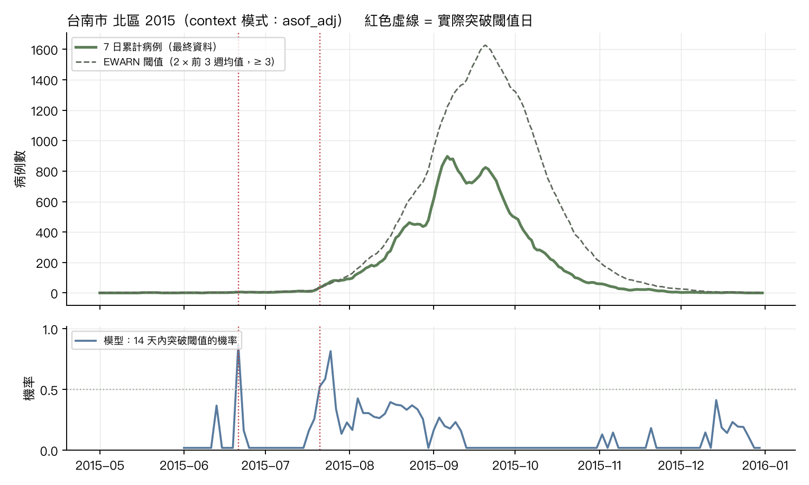
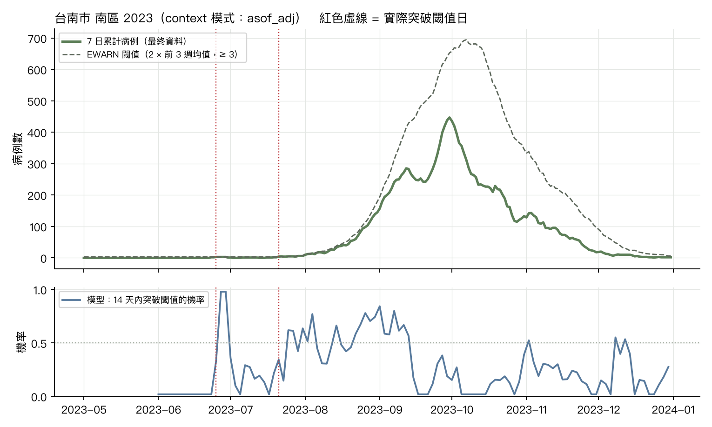

# 登革熱鄉鎮每日回測：閾值突破預警（CHG 情境一，第一版）

資料：登革熱每日確定病例（本土，居住鄉鎮），台南 37 區 + 高雄 38 區中 2012 起有病例的 74 區；目標 = 7 日累計病例；閾值 = max(2 × 前 3 週週均值, 3 例)（EWARN 規則加下限）。
起點：2014, 2015, 2016, 2019, 2023, 2024 年 6–12 月每 2 天；horizon 1–14 天；context 2 年（730 天）。模式：final = 以最終資料為 context（無通報延遲）、asof = 只用起點當日已通報者、asof_adj = as-of 除以歷史通報完整度。

## 1. 7 日累計的分布預測表現（WIS 越低越好；cov80 理想 0.80）

|                        |   WIS h=1 |   WIS h=3 |   WIS h=5 |   WIS h=7 |   WIS h=10 |   WIS h=14 |   cov80 h=7 |   cov80 h=14 |
|:-----------------------|----------:|----------:|----------:|----------:|-----------:|-----------:|------------:|-------------:|
| ('asof', 'naive')      |      2.03 |      2.15 |      2.33 |      2.54 |       2.87 |       3.33 |        0.81 |         0.8  |
| ('asof', 'snaive')     |      9.58 |      9.65 |      9.71 |      9.78 |       9.85 |       9.96 |        0.75 |         0.74 |
| ('asof', 'tfm')        |      2.22 |      2.45 |      2.46 |      2.42 |       2.5  |       2.83 |        0.87 |         0.88 |
| ('asof_adj', 'naive')  |      1.71 |      2.07 |      2.51 |      2.93 |       3.47 |       4.12 |        0.79 |         0.78 |
| ('asof_adj', 'snaive') |      9.57 |      9.64 |      9.71 |      9.77 |       9.85 |       9.96 |        0.75 |         0.74 |
| ('asof_adj', 'tfm')    |      1.5  |      1.7  |      2.01 |      2.33 |       2.79 |       3.44 |        0.87 |         0.87 |
| ('final', 'naive')     |      0.42 |      1.01 |      1.55 |      2.02 |       2.53 |       3.19 |        0.8  |         0.79 |
| ('final', 'snaive')    |      9.57 |      9.64 |      9.71 |      9.77 |       9.85 |       9.96 |        0.75 |         0.74 |
| ('final', 'tfm')       |      0.3  |      0.69 |      1.11 |      1.53 |       1.99 |       2.59 |        0.88 |         0.88 |

h = 7 的 WIS 依年份類型（大流行年 = 2014、2015、2023）：

|                        |   大流行年 |   非流行年 |
|:-----------------------|-------:|-------:|
| ('asof', 'naive')      |   5.04 |   0.04 |
| ('asof', 'snaive')     |  10.18 |   9.37 |
| ('asof', 'tfm')        |   4.81 |   0.02 |
| ('asof_adj', 'naive')  |   5.82 |   0.04 |
| ('asof_adj', 'snaive') |  10.18 |   9.37 |
| ('asof_adj', 'tfm')    |   4.64 |   0.03 |
| ('final', 'naive')     |   4    |   0.04 |
| ('final', 'snaive')    |  10.18 |   9.37 |
| ('final', 'tfm')       |   3.03 |   0.03 |

## 2. 閾值突破預警：機率技巧與 p* 取捨

事件 = 未來 14 天內 7 日累計 ≥ 起點當日的閾值；模型機率 = 各 horizon 機率的最大值。假警報率以「鄉鎮 × 週」計：該週任一起點發警示即算一次警示週，該週任一起點有事件即算事件週。

AUC（鄉鎮週層級，事件 vs 模型機率）：

| mode     |   naive |   snaive |   tfm |
|:---------|--------:|---------:|------:|
| asof     |   0.714 |    0.663 | 0.868 |
| asof_adj |   0.758 |    0.656 | 0.887 |
| final    |   0.744 |    0.655 | 0.931 |

TimesFM（final）p* 掃描（13,986 鄉鎮週，其中事件週 1,246）：

|   p_star |   sensitivity |   false_alarm_per100 |   ppv |   alerts |
|---------:|--------------:|---------------------:|------:|---------:|
|      0.2 |         0.724 |                7.614 | 0.482 |     1872 |
|      0.3 |         0.595 |                3.964 | 0.595 |     1246 |
|      0.4 |         0.493 |                2.159 | 0.691 |      889 |
|      0.5 |         0.396 |                1.217 | 0.761 |      649 |
|      0.6 |         0.312 |                0.722 | 0.809 |      481 |
|      0.7 |         0.205 |                0.204 | 0.907 |      281 |
|      0.8 |         0.124 |                0.094 | 0.928 |      167 |
|      0.9 |         0.067 |                0.031 | 0.954 |       87 |

TimesFM（asof）p* 掃描（13,986 鄉鎮週，其中事件週 1,409）：

|   p_star |   sensitivity |   false_alarm_per100 |   ppv |   alerts |
|---------:|--------------:|---------------------:|------:|---------:|
|      0.2 |         0.498 |                4.906 | 0.532 |     1319 |
|      0.3 |         0.34  |                2.226 | 0.631 |      759 |
|      0.4 |         0.232 |                0.898 | 0.743 |      440 |
|      0.5 |         0.139 |                0.406 | 0.794 |      247 |
|      0.6 |         0.085 |                0.127 | 0.882 |      136 |
|      0.7 |         0.057 |                0.032 | 0.953 |       85 |
|      0.8 |         0.032 |                0.016 | 0.957 |       47 |
|      0.9 |         0.018 |                0     | 1     |       26 |

TimesFM（asof_adj）p* 掃描（13,986 鄉鎮週，其中事件週 1,241）：

|   p_star |   sensitivity |   false_alarm_per100 |   ppv |   alerts |
|---------:|--------------:|---------------------:|------:|---------:|
|      0.2 |         0.65  |                8.16  | 0.437 |     1847 |
|      0.3 |         0.525 |                5.124 | 0.5   |     1305 |
|      0.4 |         0.432 |                3.036 | 0.581 |      923 |
|      0.5 |         0.345 |                1.922 | 0.636 |      673 |
|      0.6 |         0.255 |                1.224 | 0.67  |      473 |
|      0.7 |         0.185 |                0.824 | 0.687 |      335 |
|      0.8 |         0.118 |                0.408 | 0.739 |      199 |
|      0.9 |         0.063 |                0.196 | 0.757 |      103 |

## 3. 前置時間：模型預警 vs EWARN 靜態規則、EWMA、CUSUM

事件（episode）= 最終資料的 7 日累計首次達到當日 EWARN 閾值，且之前至少 14 天低於閾值。EWARN 靜態規則在事件當天才觸發（前置 0 天）。模型：事件前 14 天內最早發出警示（機率 ≥ p*）的起點到事件日的天數；EWMA/CUSUM：事件前 14 天內最早的警報日。

事件數（2014, 2015, 2016, 2019, 2023, 2024 年 6–12 月）：226，其中大流行年 221。

| 方法                      |   偵測到的事件比例 |   前置時間中位數（天） |   前置 ≥ 3 天的比例 |
|:------------------------|-----------:|-------------:|--------------:|
| EWARN 靜態規則              |       1    |          0   |          0    |
| EWMA                    |       0.12 |          2   |          0.04 |
| CUSUM                   |       0.52 |          1   |          0.19 |
| TimesFM final p*=0.3    |       0.55 |          5   |          0.41 |
| TimesFM final p*=0.5    |       0.31 |          4   |          0.22 |
| TimesFM final p*=0.7    |       0.11 |          2   |          0.05 |
| TimesFM asof p*=0.3     |       0.25 |         11.5 |          0.19 |
| TimesFM asof p*=0.5     |       0.08 |          6   |          0.07 |
| TimesFM asof p*=0.7     |       0.01 |          7   |          0.01 |
| TimesFM asof_adj p*=0.3 |       0.5  |          5   |          0.35 |
| TimesFM asof_adj p*=0.5 |       0.34 |          4   |          0.21 |
| TimesFM asof_adj p*=0.7 |       0.18 |          3   |          0.11 |

統計偵測器在非事件期間（事件前後 14 天以外）的假警報：

| 方法    |   非事件鄉鎮週數 |   假警報週 |   每 100 鄉鎮週假警報 |
|:------|----------:|-------:|---------------:|
| EWMA  |     13252 |    190 |           1.43 |
| CUSUM |     13252 |    565 |           4.26 |

配對比較：在不高於各偵測器假警報率的 p* 下，模型的敏感度與前置時間：

| 對照偵測器   |   其假警報/100 鄉鎮週 | 模式       |   模型 p* |   模型假警報/100 |   模型敏感度（週） |   模型偵測事件比例 |   模型前置中位數（天） |
|:--------|---------------:|:---------|--------:|------------:|-----------:|-----------:|-------------:|
| EWMA    |           1.43 | final    |     0.5 |        1.22 |      0.396 |       0.31 |          4   |
| EWMA    |           1.43 | asof     |     0.4 |        0.9  |      0.232 |       0.17 |          8   |
| EWMA    |           1.43 | asof_adj |     0.6 |        1.22 |      0.255 |       0.27 |          3   |
| CUSUM   |           4.26 | final    |     0.3 |        3.96 |      0.595 |       0.55 |          5   |
| CUSUM   |           4.26 | asof     |     0.3 |        2.23 |      0.34  |       0.25 |         11.5 |
| CUSUM   |           4.26 | asof_adj |     0.4 |        3.04 |      0.432 |       0.44 |          4   |

## 案例：台南市 北區 2015

## 案例：台南市 南區 2023

