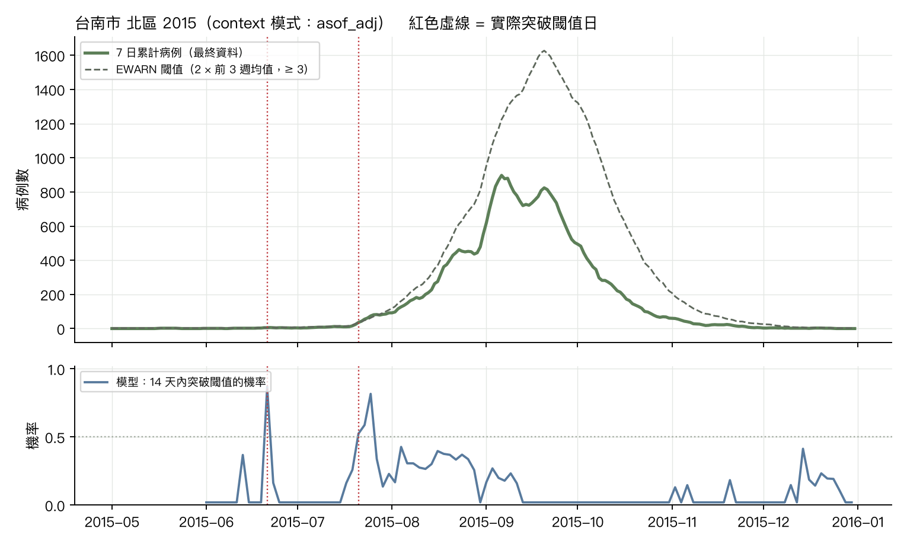
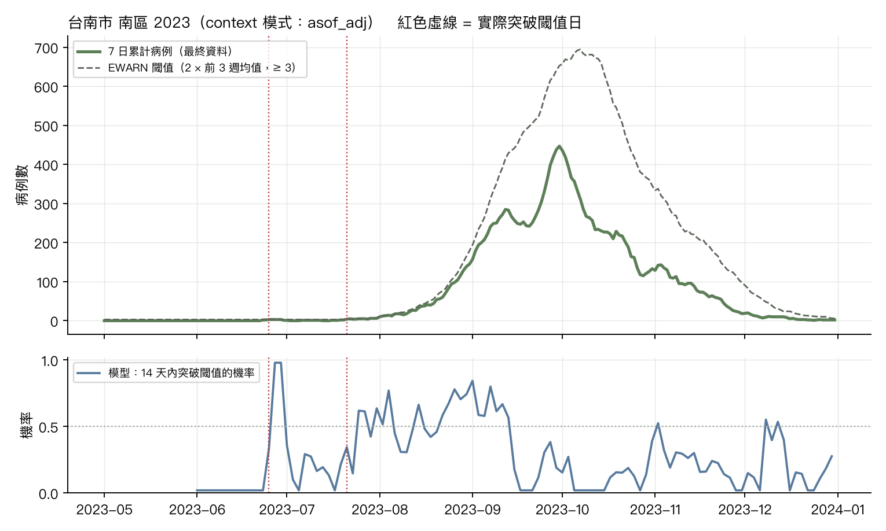

# 登革熱鄉鎮每日回測：閾值突破預警（CHG 情境一，第一版）

資料：登革熱每日確定病例（本土，居住鄉鎮），台南 37 區 + 高雄 38 區中 2012 起有病例的 74 區；目標 = 7 日累計病例；閾值 = max(2 × 前 3 週週均值, 3 例)（EWARN 規則加下限）。
起點：2010, 2011, 2012, 2014, 2015, 2016, 2019, 2023, 2024 年 6–12 月每 2 天；horizon 1–14 天；context 2 年（730 天）。模式：final = 以最終資料為 context（無通報延遲）、asof = 只用起點當日已通報者、asof_adj = as-of 除以歷史通報完整度。
事件（真值）= 最終資料的 7 日累計 ≥ 以最終資料計算的起點當日 EWARN 閾值，三種模式共用同一組事件；警示機率則用各模式在起點當日可得資料算出的閾值。面板自 2008-01-01 起；流行年 = 2010、2011、2012、2014、2015、2023（該年本土病例 ≥ 1,000）。

## 1. 7 日累計的分布預測表現（WIS 越低越好；cov80 理想 0.80）

|                          |   WIS h=1 |   WIS h=3 |   WIS h=5 |   WIS h=7 |   WIS h=10 |   WIS h=14 |   cov80 h=7 |   cov80 h=14 |
|:-------------------------|----------:|----------:|----------:|----------:|-----------:|-----------:|------------:|-------------:|
| ('asof', 'naive')        |      1.47 |      1.55 |      1.68 |      1.82 |       2.05 |       2.37 |        0.84 |         0.83 |
| ('asof', 'snaive')       |      6.62 |      6.66 |      6.71 |      6.75 |       6.81 |       6.88 |        0.8  |         0.79 |
| ('asof', 'tfm')          |      1.59 |      1.75 |      1.75 |      1.73 |       1.79 |       2.01 |        0.88 |         0.89 |
| ('asof_adj', 'naive')    |      1.24 |      1.5  |      1.81 |      2.1  |       2.47 |       2.92 |        0.82 |         0.82 |
| ('asof_adj', 'snaive')   |      6.61 |      6.66 |      6.71 |      6.75 |       6.81 |       6.88 |        0.8  |         0.79 |
| ('asof_adj', 'tfm')      |      1.09 |      1.23 |      1.45 |      1.67 |       1.99 |       2.44 |        0.88 |         0.89 |
| ('asof_nc2', 'naive')    |      1.4  |      1.75 |      2.08 |      2.36 |       2.74 |       3.22 |        0.15 |         0.16 |
| ('asof_nc2', 'snaive')   |      6.61 |      6.66 |      6.71 |      6.75 |       6.81 |       6.88 |        0.79 |         0.79 |
| ('asof_nc2', 'tfm')      |      1.39 |      1.78 |      2.11 |      2.37 |       2.77 |       3.4  |        0.35 |         0.51 |
| ('asof_nc7', 'naive')    |      1.46 |      1.81 |      2.12 |      2.41 |       2.78 |       3.25 |        0.15 |         0.16 |
| ('asof_nc7', 'snaive')   |      6.61 |      6.66 |      6.71 |      6.75 |       6.81 |       6.88 |        0.79 |         0.79 |
| ('asof_nc7', 'tfm')      |      1.46 |      1.85 |      2.17 |      2.42 |       2.78 |       3.34 |        0.33 |         0.51 |
| ('asof_nc7x2', 'naive')  |      1.38 |      1.73 |      2.06 |      2.34 |       2.72 |       3.19 |        0.15 |         0.16 |
| ('asof_nc7x2', 'snaive') |      6.61 |      6.66 |      6.71 |      6.75 |       6.81 |       6.88 |        0.79 |         0.79 |
| ('asof_nc7x2', 'tfm')    |      1.36 |      1.73 |      2.05 |      2.31 |       2.68 |       3.25 |        0.32 |         0.51 |
| ('asof_ncr1', 'naive')   |      1.21 |      1.57 |      1.9  |      2.19 |       2.56 |       3.03 |        0.82 |         0.82 |
| ('asof_ncr1', 'snaive')  |      6.61 |      6.66 |      6.71 |      6.75 |       6.81 |       6.88 |        0.8  |         0.79 |
| ('asof_ncr1', 'tfm')     |      1.17 |      1.49 |      1.78 |      2.01 |       2.33 |       2.78 |        0.88 |         0.89 |
| ('asof_ncr7', 'naive')   |      1.3  |      1.64 |      1.96 |      2.24 |       2.61 |       3.07 |        0.82 |         0.82 |
| ('asof_ncr7', 'snaive')  |      6.61 |      6.66 |      6.71 |      6.75 |       6.81 |       6.88 |        0.8  |         0.79 |
| ('asof_ncr7', 'tfm')     |      1.27 |      1.6  |      1.86 |      2.08 |       2.38 |       2.82 |        0.88 |         0.89 |
| ('final', 'naive')       |      0.31 |      0.74 |      1.13 |      1.46 |       1.82 |       2.27 |        0.83 |         0.82 |
| ('final', 'snaive')      |      6.61 |      6.66 |      6.71 |      6.75 |       6.81 |       6.88 |        0.8  |         0.79 |
| ('final', 'tfm')         |      0.22 |      0.51 |      0.82 |      1.12 |       1.44 |       1.86 |        0.89 |         0.9  |

h = 7 的 WIS 依年份類型（流行年 = 2010、2011、2012、2014、2015、2023）：

|                          |   流行年 |   非流行年 |
|:-------------------------|------:|-------:|
| ('asof', 'naive')        |  2.72 |   0.04 |
| ('asof', 'snaive')       |  5.45 |   9.37 |
| ('asof', 'tfm')          |  2.58 |   0.02 |
| ('asof_adj', 'naive')    |  3.13 |   0.04 |
| ('asof_adj', 'snaive')   |  5.44 |   9.37 |
| ('asof_adj', 'tfm')      |  2.5  |   0.03 |
| ('asof_nc2', 'naive')    |  3.5  |   0.08 |
| ('asof_nc2', 'snaive')   |  5.45 |   9.37 |
| ('asof_nc2', 'tfm')      |  3.45 |   0.21 |
| ('asof_nc7', 'naive')    |  3.57 |   0.08 |
| ('asof_nc7', 'snaive')   |  5.45 |   9.37 |
| ('asof_nc7', 'tfm')      |  3.51 |   0.22 |
| ('asof_nc7x2', 'naive')  |  3.47 |   0.08 |
| ('asof_nc7x2', 'snaive') |  5.45 |   9.37 |
| ('asof_nc7x2', 'tfm')    |  3.35 |   0.22 |
| ('asof_ncr1', 'naive')   |  3.26 |   0.04 |
| ('asof_ncr1', 'snaive')  |  5.45 |   9.37 |
| ('asof_ncr1', 'tfm')     |  3    |   0.02 |
| ('asof_ncr7', 'naive')   |  3.35 |   0.04 |
| ('asof_ncr7', 'snaive')  |  5.45 |   9.37 |
| ('asof_ncr7', 'tfm')     |  3.11 |   0.02 |
| ('final', 'naive')       |  2.18 |   0.04 |
| ('final', 'snaive')      |  5.44 |   9.37 |
| ('final', 'tfm')         |  1.67 |   0.03 |

## 2. 閾值突破預警：機率技巧與 p* 取捨

事件 = 未來 14 天內 7 日累計 ≥ 起點當日以最終資料計算的閾值（三種模式相同）；模型機率 = 各 horizon 機率的最大值（機率的閾值為該模式當日可得資料所算）。假警報率以「鄉鎮 × 週」計：該週任一起點發警示即算一次警示週，該週任一起點有事件即算事件週。

AUC（鄉鎮週層級，事件 vs 模型機率）：

| mode       |   naive |   snaive |   tfm |
|:-----------|--------:|---------:|------:|
| asof       |   0.706 |    0.687 | 0.863 |
| asof_adj   |   0.771 |    0.684 | 0.89  |
| asof_nc2   |   0.732 |    0.685 | 0.818 |
| asof_nc7   |   0.729 |    0.686 | 0.838 |
| asof_nc7x2 |   0.732 |    0.685 | 0.845 |
| asof_ncr1  |   0.734 |    0.686 | 0.875 |
| asof_ncr7  |   0.728 |    0.685 | 0.907 |
| final      |   0.752 |    0.683 | 0.934 |

TimesFM（final）p* 掃描（20,868 鄉鎮週，其中事件週 1,619）：

|   p_star |   sensitivity |   false_alarm_per100 |   ppv |   alerts |
|---------:|--------------:|---------------------:|------:|---------:|
|      0.2 |         0.711 |                6.364 | 0.484 |     2376 |
|      0.3 |         0.587 |                3.314 | 0.598 |     1589 |
|      0.4 |         0.486 |                1.849 | 0.689 |     1143 |
|      0.5 |         0.395 |                1.075 | 0.755 |      846 |
|      0.6 |         0.311 |                0.655 | 0.8   |      629 |
|      0.7 |         0.212 |                0.187 | 0.905 |      379 |
|      0.8 |         0.129 |                0.094 | 0.921 |      227 |
|      0.9 |         0.072 |                0.031 | 0.951 |      123 |

TimesFM（asof）p* 掃描（20,868 鄉鎮週，其中事件週 1,619）：

|   p_star |   sensitivity |   false_alarm_per100 |   ppv |   alerts |
|---------:|--------------:|---------------------:|------:|---------:|
|      0.2 |         0.482 |                4.447 | 0.477 |     1637 |
|      0.3 |         0.34  |                2.042 | 0.583 |      943 |
|      0.4 |         0.235 |                0.826 | 0.706 |      540 |
|      0.5 |         0.145 |                0.369 | 0.767 |      305 |
|      0.6 |         0.09  |                0.135 | 0.848 |      171 |
|      0.7 |         0.057 |                0.042 | 0.921 |      101 |
|      0.8 |         0.032 |                0.021 | 0.927 |       55 |
|      0.9 |         0.017 |                0     | 1     |       27 |

TimesFM（asof_adj）p* 掃描（20,868 鄉鎮週，其中事件週 1,619）：

|   p_star |   sensitivity |   false_alarm_per100 |   ppv |   alerts |
|---------:|--------------:|---------------------:|------:|---------:|
|      0.2 |         0.641 |                6.733 | 0.444 |     2333 |
|      0.3 |         0.526 |                4.239 | 0.51  |     1667 |
|      0.4 |         0.44  |                2.488 | 0.598 |     1191 |
|      0.5 |         0.353 |                1.616 | 0.648 |      883 |
|      0.6 |         0.274 |                1.101 | 0.676 |      655 |
|      0.7 |         0.201 |                0.774 | 0.686 |      474 |
|      0.8 |         0.13  |                0.436 | 0.714 |      294 |
|      0.9 |         0.074 |                0.239 | 0.723 |      166 |

TimesFM（asof_nc2）p* 掃描（20,868 鄉鎮週，其中事件週 1,619）：

|   p_star |   sensitivity |   false_alarm_per100 |   ppv |   alerts |
|---------:|--------------:|---------------------:|------:|---------:|
|      0.2 |         0.579 |               15.985 | 0.233 |     4014 |
|      0.3 |         0.439 |               10.676 | 0.257 |     2765 |
|      0.4 |         0.33  |                8.115 | 0.255 |     2096 |
|      0.5 |         0.233 |                5.605 | 0.259 |     1457 |
|      0.6 |         0.159 |                4.603 | 0.225 |     1143 |
|      0.7 |         0.104 |                3.314 | 0.209 |      807 |
|      0.8 |         0.065 |                1.709 | 0.242 |      434 |
|      0.9 |         0.034 |                0.499 | 0.364 |      151 |

TimesFM（asof_nc7）p* 掃描（20,868 鄉鎮週，其中事件週 1,619）：

|   p_star |   sensitivity |   false_alarm_per100 |   ppv |   alerts |
|---------:|--------------:|---------------------:|------:|---------:|
|      0.2 |         0.566 |               14.619 | 0.246 |     3730 |
|      0.3 |         0.419 |                7.065 | 0.333 |     2038 |
|      0.4 |         0.305 |                4.291 | 0.374 |     1320 |
|      0.5 |         0.218 |                2.556 | 0.418 |      845 |
|      0.6 |         0.142 |                1.465 | 0.449 |      512 |
|      0.7 |         0.09  |                0.784 | 0.492 |      297 |
|      0.8 |         0.049 |                0.255 | 0.617 |      128 |
|      0.9 |         0.027 |                0.052 | 0.815 |       54 |

TimesFM（asof_nc7x2）p* 掃描（20,868 鄉鎮週，其中事件週 1,619）：

|   p_star |   sensitivity |   false_alarm_per100 |   ppv |   alerts |
|---------:|--------------:|---------------------:|------:|---------:|
|      0.2 |         0.578 |               14.536 | 0.25  |     3733 |
|      0.3 |         0.434 |                7.05  | 0.341 |     2060 |
|      0.4 |         0.323 |                4.224 | 0.391 |     1336 |
|      0.5 |         0.232 |                2.488 | 0.44  |      855 |
|      0.6 |         0.163 |                1.429 | 0.49  |      539 |
|      0.7 |         0.107 |                0.738 | 0.549 |      315 |
|      0.8 |         0.065 |                0.26  | 0.677 |      155 |
|      0.9 |         0.033 |                0.047 | 0.857 |       63 |

TimesFM（asof_ncr1）p* 掃描（20,868 鄉鎮週，其中事件週 1,619）：

|   p_star |   sensitivity |   false_alarm_per100 |   ppv |   alerts |
|---------:|--------------:|---------------------:|------:|---------:|
|      0.2 |         0.55  |                5.761 | 0.445 |     1999 |
|      0.3 |         0.421 |                3.05  | 0.537 |     1268 |
|      0.4 |         0.314 |                1.455 | 0.645 |      788 |
|      0.5 |         0.225 |                0.686 | 0.734 |      497 |
|      0.6 |         0.153 |                0.286 | 0.818 |      302 |
|      0.7 |         0.1   |                0.119 | 0.876 |      185 |
|      0.8 |         0.061 |                0.036 | 0.934 |      106 |
|      0.9 |         0.032 |                0     | 1     |       52 |

TimesFM（asof_ncr7）p* 掃描（20,868 鄉鎮週，其中事件週 1,619）：

|   p_star |   sensitivity |   false_alarm_per100 |   ppv |   alerts |
|---------:|--------------:|---------------------:|------:|---------:|
|      0.2 |         0.516 |                5.356 | 0.448 |     1867 |
|      0.3 |         0.375 |                2.618 | 0.546 |     1111 |
|      0.4 |         0.267 |                1.205 | 0.651 |      664 |
|      0.5 |         0.178 |                0.545 | 0.733 |      393 |
|      0.6 |         0.115 |                0.208 | 0.823 |      226 |
|      0.7 |         0.072 |                0.088 | 0.872 |      133 |
|      0.8 |         0.037 |                0.021 | 0.938 |       64 |
|      0.9 |         0.02  |                0     | 1     |       32 |

分層（asof_adj，TimesFM）：區域 × 起點的事件型態。下限群聚 = 起點閾值在 3 例下限（非流行區的第一個群聚）；流行中加速 = 閾值高於下限（流行已在進行）。

| 區域   | 事件型態   |   鄉鎮週 |   事件週 |   AUC |   p_star |   敏感度 |   假警報/100 |   PPV |
|:-----|:-------|------:|------:|------:|---------:|------:|----------:|------:|
| 台南高雄 | 下限群聚   | 18261 |   589 | 0.792 |      0.3 | 0.285 |     1.913 | 0.332 |
| 台南高雄 | 下限群聚   | 18261 |   589 | 0.792 |      0.5 | 0.214 |     1.03  | 0.409 |
| 台南高雄 | 流行中加速  |  2607 |  1030 | 0.764 |      0.3 | 0.663 |    30.311 | 0.588 |
| 台南高雄 | 流行中加速  |  2607 |  1030 | 0.764 |      0.5 | 0.433 |     8.18  | 0.776 |

## 3. 前置時間：模型預警 vs EWARN 靜態規則、EWMA、CUSUM

事件（episode）= 最終資料的 7 日累計首次達到當日 EWARN 閾值，且之前至少 14 天低於閾值。EWARN 靜態規則在事件當天才觸發（前置 0 天）。模型：事件前 14 天內最早發出警示（機率 ≥ p*）的起點到事件日的天數；EWMA/CUSUM：事件前 14 天內最早的警報日。

事件數（2010, 2011, 2012, 2014, 2015, 2016, 2019, 2023, 2024 年 6–12 月）：313，其中流行年 308。

| 方法                        |   偵測到的事件比例 |   前置時間中位數（天） |   前置 ≥ 3 天的比例 |
|:--------------------------|-----------:|-------------:|--------------:|
| EWARN 靜態規則                |       1    |          0   |          0    |
| EWMA                      |       0.09 |          2   |          0.04 |
| CUSUM                     |       0.52 |          0   |          0.18 |
| TimesFM final p*=0.3      |       0.54 |          5   |          0.4  |
| TimesFM final p*=0.5      |       0.3  |          4   |          0.2  |
| TimesFM final p*=0.7      |       0.11 |          3   |          0.06 |
| TimesFM asof p*=0.3       |       0.24 |         11   |          0.2  |
| TimesFM asof p*=0.5       |       0.08 |          6   |          0.07 |
| TimesFM asof p*=0.7       |       0.02 |          7   |          0.01 |
| TimesFM asof_adj p*=0.3   |       0.49 |          6.5 |          0.34 |
| TimesFM asof_adj p*=0.5   |       0.34 |          4   |          0.2  |
| TimesFM asof_adj p*=0.7   |       0.2  |          3   |          0.12 |
| TimesFM asof_nc2 p*=0.3   |       0.35 |         11   |          0.28 |
| TimesFM asof_nc2 p*=0.5   |       0.19 |          6   |          0.13 |
| TimesFM asof_nc2 p*=0.7   |       0.05 |          5   |          0.04 |
| TimesFM asof_nc7 p*=0.3   |       0.32 |         12   |          0.26 |
| TimesFM asof_nc7 p*=0.5   |       0.17 |          6   |          0.12 |
| TimesFM asof_nc7 p*=0.7   |       0.03 |          4   |          0.02 |
| TimesFM asof_nc7x2 p*=0.3 |       0.33 |         11.5 |          0.27 |
| TimesFM asof_nc7x2 p*=0.5 |       0.18 |          6   |          0.12 |
| TimesFM asof_nc7x2 p*=0.7 |       0.04 |          7.5 |          0.03 |
| TimesFM asof_ncr1 p*=0.3  |       0.32 |         10   |          0.24 |
| TimesFM asof_ncr1 p*=0.5  |       0.17 |          4   |          0.11 |
| TimesFM asof_ncr1 p*=0.7  |       0.04 |          5   |          0.03 |
| TimesFM asof_ncr7 p*=0.3  |       0.27 |         11   |          0.21 |
| TimesFM asof_ncr7 p*=0.5  |       0.11 |          6   |          0.08 |
| TimesFM asof_ncr7 p*=0.7  |       0.02 |          7   |          0.01 |

統計偵測器在非事件期間（事件前後 14 天以外）的假警報：

| 方法    |   非事件鄉鎮週數 |   假警報週 |   每 100 鄉鎮週假警報 |
|:------|----------:|-------:|---------------:|
| EWMA  |     19920 |    213 |           1.07 |
| CUSUM |     19920 |    636 |           3.19 |

配對比較：在不高於各偵測器假警報率的 p* 下，模型的敏感度與前置時間：

| 對照偵測器   |   其假警報/100 鄉鎮週 | 模式         |   模型 p* |   模型假警報/100 |   模型敏感度（週） |   模型偵測事件比例 |   模型前置中位數（天） |
|:--------|---------------:|:-----------|--------:|------------:|-----------:|-----------:|-------------:|
| EWMA    |           1.07 | final      |     0.6 |        0.65 |      0.311 |       0.18 |          4.5 |
| EWMA    |           1.07 | asof       |     0.4 |        0.83 |      0.235 |       0.16 |          9   |
| EWMA    |           1.07 | asof_adj   |     0.7 |        0.77 |      0.201 |       0.2  |          3   |
| EWMA    |           1.07 | asof_nc2   |     0.9 |        0.5  |      0.034 |       0    |        nan   |
| EWMA    |           1.07 | asof_nc7   |     0.7 |        0.78 |      0.09  |       0.03 |          4   |
| EWMA    |           1.07 | asof_nc7x2 |     0.7 |        0.74 |      0.107 |       0.04 |          7.5 |
| EWMA    |           1.07 | asof_ncr1  |     0.5 |        0.69 |      0.225 |       0.17 |          4   |
| EWMA    |           1.07 | asof_ncr7  |     0.5 |        0.55 |      0.178 |       0.11 |          6   |
| CUSUM   |           3.19 | final      |     0.4 |        1.85 |      0.486 |       0.42 |          4   |
| CUSUM   |           3.19 | asof       |     0.3 |        2.04 |      0.34  |       0.24 |         11   |
| CUSUM   |           3.19 | asof_adj   |     0.4 |        2.49 |      0.44  |       0.43 |          4   |
| CUSUM   |           3.19 | asof_nc2   |     0.8 |        1.71 |      0.065 |       0.01 |          6   |
| CUSUM   |           3.19 | asof_nc7   |     0.5 |        2.56 |      0.218 |       0.17 |          6   |
| CUSUM   |           3.19 | asof_nc7x2 |     0.5 |        2.49 |      0.232 |       0.18 |          6   |
| CUSUM   |           3.19 | asof_ncr1  |     0.3 |        3.05 |      0.421 |       0.32 |         10   |
| CUSUM   |           3.19 | asof_ncr7  |     0.3 |        2.62 |      0.375 |       0.27 |         11   |

分層的前置時間：區域 × 事件型態（依突破當日的最終資料閾值；下限群聚 = 閾值在 3 例下限）：

| 區域   | 事件型態   |   事件數 |   其中平靜年 | 方法                        |   偵測到的事件比例 |   前置時間中位數（天） |   前置 ≥ 3 天的比例 |
|:-----|:-------|------:|--------:|:--------------------------|-----------:|-------------:|--------------:|
| 台南高雄 | 下限群聚   |   170 |       4 | EWMA                      |       0    |        nan   |        nan    |
| 台南高雄 | 下限群聚   |   170 |       4 | CUSUM                     |       0.28 |          0   |          0.01 |
| 台南高雄 | 下限群聚   |   170 |       4 | TimesFM final p*=0.3      |       0.39 |          4   |          0.26 |
| 台南高雄 | 下限群聚   |   170 |       4 | TimesFM final p*=0.5      |       0.22 |          4   |          0.15 |
| 台南高雄 | 下限群聚   |   170 |       4 | TimesFM asof p*=0.3       |       0.12 |         11.5 |          0.08 |
| 台南高雄 | 下限群聚   |   170 |       4 | TimesFM asof p*=0.5       |       0.04 |          4.5 |          0.02 |
| 台南高雄 | 下限群聚   |   170 |       4 | TimesFM asof_adj p*=0.3   |       0.37 |          3   |          0.21 |
| 台南高雄 | 下限群聚   |   170 |       4 | TimesFM asof_adj p*=0.5   |       0.25 |          2   |          0.12 |
| 台南高雄 | 下限群聚   |   170 |       4 | TimesFM asof_nc2 p*=0.3   |       0.22 |         11   |          0.15 |
| 台南高雄 | 下限群聚   |   170 |       4 | TimesFM asof_nc2 p*=0.5   |       0.1  |          3   |          0.06 |
| 台南高雄 | 下限群聚   |   170 |       4 | TimesFM asof_nc7 p*=0.3   |       0.18 |         12   |          0.12 |
| 台南高雄 | 下限群聚   |   170 |       4 | TimesFM asof_nc7 p*=0.5   |       0.09 |          3   |          0.05 |
| 台南高雄 | 下限群聚   |   170 |       4 | TimesFM asof_nc7x2 p*=0.3 |       0.18 |         12   |          0.12 |
| 台南高雄 | 下限群聚   |   170 |       4 | TimesFM asof_nc7x2 p*=0.5 |       0.09 |          3   |          0.05 |
| 台南高雄 | 下限群聚   |   170 |       4 | TimesFM asof_ncr1 p*=0.3  |       0.19 |          3.5 |          0.11 |
| 台南高雄 | 下限群聚   |   170 |       4 | TimesFM asof_ncr1 p*=0.5  |       0.09 |          1.5 |          0.03 |
| 台南高雄 | 下限群聚   |   170 |       4 | TimesFM asof_ncr7 p*=0.3  |       0.13 |         11.5 |          0.08 |
| 台南高雄 | 下限群聚   |   170 |       4 | TimesFM asof_ncr7 p*=0.5  |       0.05 |          2   |          0.02 |
| 台南高雄 | 流行中加速  |   143 |       1 | EWMA                      |       0.2  |          2   |          0.08 |
| 台南高雄 | 流行中加速  |   143 |       1 | CUSUM                     |       0.81 |          2   |          0.38 |
| 台南高雄 | 流行中加速  |   143 |       1 | TimesFM final p*=0.3      |       0.71 |         10   |          0.57 |
| 台南高雄 | 流行中加速  |   143 |       1 | TimesFM final p*=0.5      |       0.4  |          4   |          0.26 |
| 台南高雄 | 流行中加速  |   143 |       1 | TimesFM asof p*=0.3       |       0.39 |         11   |          0.34 |
| 台南高雄 | 流行中加速  |   143 |       1 | TimesFM asof p*=0.5       |       0.14 |          6.5 |          0.12 |
| 台南高雄 | 流行中加速  |   143 |       1 | TimesFM asof_adj p*=0.3   |       0.64 |          9   |          0.5  |
| 台南高雄 | 流行中加速  |   143 |       1 | TimesFM asof_adj p*=0.5   |       0.45 |          6   |          0.3  |
| 台南高雄 | 流行中加速  |   143 |       1 | TimesFM asof_nc2 p*=0.3   |       0.51 |         11   |          0.43 |
| 台南高雄 | 流行中加速  |   143 |       1 | TimesFM asof_nc2 p*=0.5   |       0.29 |          7   |          0.22 |
| 台南高雄 | 流行中加速  |   143 |       1 | TimesFM asof_nc7 p*=0.3   |       0.48 |         12   |          0.43 |
| 台南高雄 | 流行中加速  |   143 |       1 | TimesFM asof_nc7 p*=0.5   |       0.27 |          7.5 |          0.21 |
| 台南高雄 | 流行中加速  |   143 |       1 | TimesFM asof_nc7x2 p*=0.3 |       0.52 |         11   |          0.45 |
| 台南高雄 | 流行中加速  |   143 |       1 | TimesFM asof_nc7x2 p*=0.5 |       0.27 |          7   |          0.21 |
| 台南高雄 | 流行中加速  |   143 |       1 | TimesFM asof_ncr1 p*=0.3  |       0.47 |         11   |          0.4  |
| 台南高雄 | 流行中加速  |   143 |       1 | TimesFM asof_ncr1 p*=0.5  |       0.27 |          6   |          0.2  |
| 台南高雄 | 流行中加速  |   143 |       1 | TimesFM asof_ncr7 p*=0.3  |       0.44 |         11   |          0.36 |
| 台南高雄 | 流行中加速  |   143 |       1 | TimesFM asof_ncr7 p*=0.5  |       0.18 |          7   |          0.15 |

## 案例：台南市 北區 2015

## 案例：台南市 南區 2023

