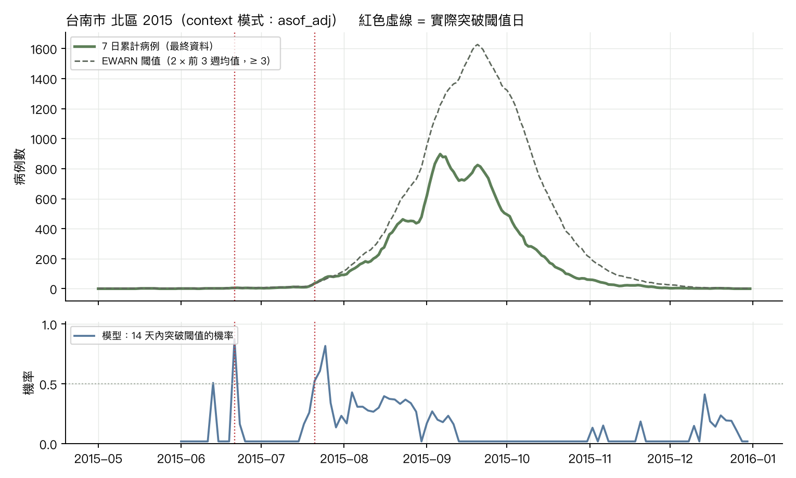
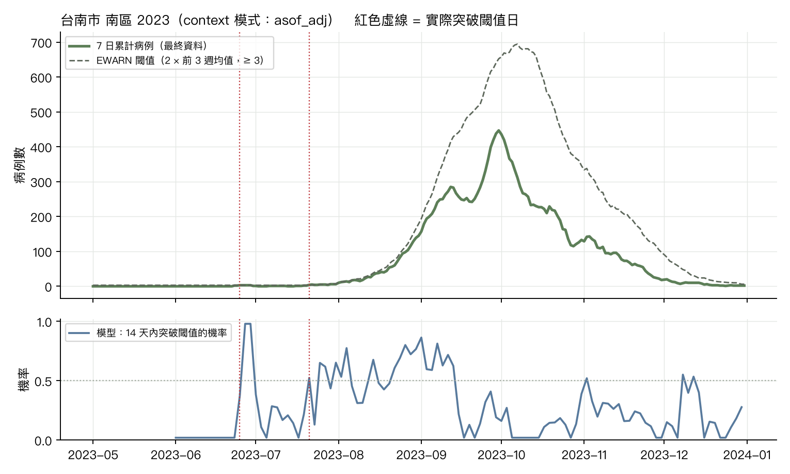

# 登革熱鄉鎮每日回測：閾值突破預警（CHG 情境一，第一版）

資料：登革熱每日確定病例（本土，居住鄉鎮），台南 37 區 + 高雄 38 區中 2012 起有病例的 274 區；目標 = 7 日累計病例；閾值 = max(2 × 前 3 週週均值, 3 例)（EWARN 規則加下限）。
起點：2010, 2011, 2012, 2013, 2014, 2015, 2016, 2018, 2019, 2020, 2023, 2024 年 6–12 月每 2 天；horizon 1–14 天；context 2 年（730 天）。模式：final = 以最終資料為 context（無通報延遲）、asof = 只用起點當日已通報者、asof_adj = as-of 除以歷史通報完整度。
事件（真值）= 最終資料的 7 日累計 ≥ 以最終資料計算的起點當日 EWARN 閾值，三種模式共用同一組事件；警示機率則用各模式在起點當日可得資料算出的閾值。面板自 2008-01-01 起；流行年 = 2010、2011、2012、2014、2015、2023（該年本土病例 ≥ 1,000）。

## 1. 7 日累計的分布預測表現（WIS 越低越好；cov80 理想 0.80）

|                        |   WIS h=1 |   WIS h=3 |   WIS h=5 |   WIS h=7 |   WIS h=10 |   WIS h=14 |   cov80 h=7 |   cov80 h=14 |
|:-----------------------|----------:|----------:|----------:|----------:|-----------:|-----------:|------------:|-------------:|
| ('asof_adj', 'naive')  |      0.3  |      0.36 |      0.43 |      0.49 |       0.56 |       0.66 |        0.94 |         0.94 |
| ('asof_adj', 'snaive') |      1.42 |      1.43 |      1.44 |      1.45 |       1.47 |       1.48 |        0.93 |         0.93 |
| ('asof_adj', 'tfm')    |      0.27 |      0.3  |      0.35 |      0.39 |       0.46 |       0.55 |        0.95 |         0.96 |
| ('final', 'naive')     |      0.07 |      0.17 |      0.26 |      0.34 |       0.41 |       0.5  |        0.94 |         0.94 |
| ('final', 'snaive')    |      1.42 |      1.43 |      1.44 |      1.45 |       1.47 |       1.48 |        0.93 |         0.93 |
| ('final', 'tfm')       |      0.05 |      0.12 |      0.2  |      0.27 |       0.34 |       0.42 |        0.95 |         0.96 |

h = 7 的 WIS 依年份類型（流行年 = 2010、2011、2012、2014、2015、2023）：

|                        |   流行年 |   非流行年 |
|:-----------------------|------:|-------:|
| ('asof_adj', 'naive')  |  0.95 |   0.03 |
| ('asof_adj', 'snaive') |  1.55 |   1.36 |
| ('asof_adj', 'tfm')    |  0.77 |   0.02 |
| ('final', 'naive')     |  0.65 |   0.02 |
| ('final', 'snaive')    |  1.55 |   1.36 |
| ('final', 'tfm')       |  0.51 |   0.02 |

h = 7 的 WIS 依區域：

|                        |   其他縣市 |   台南高雄 |
|:-----------------------|-------:|-------:|
| ('asof_adj', 'naive')  |   0.06 |   1.65 |
| ('asof_adj', 'snaive') |   0.1  |   5.11 |
| ('asof_adj', 'tfm')    |   0.05 |   1.32 |
| ('final', 'naive')     |   0.06 |   1.1  |
| ('final', 'snaive')    |   0.1  |   5.11 |
| ('final', 'tfm')       |   0.05 |   0.85 |

## 2. 閾值突破預警：機率技巧與 p* 取捨

事件 = 未來 14 天內 7 日累計 ≥ 起點當日以最終資料計算的閾值（三種模式相同）；模型機率 = 各 horizon 機率的最大值（機率的閾值為該模式當日可得資料所算）。假警報率以「鄉鎮 × 週」計：該週任一起點發警示即算一次警示週，該週任一起點有事件即算事件週。

AUC（鄉鎮週層級，事件 vs 模型機率）：

| mode     |   naive |   snaive |   tfm |
|:---------|--------:|---------:|------:|
| asof_adj |   0.774 |    0.722 | 0.894 |
| final    |   0.75  |    0.719 | 0.919 |

TimesFM（final）p* 掃描（103,024 鄉鎮週，其中事件週 2,103）：

|   p_star |   sensitivity |   false_alarm_per100 |   ppv |   alerts |
|---------:|--------------:|---------------------:|------:|---------:|
|      0.2 |         0.689 |                2.132 | 0.402 |     3601 |
|      0.3 |         0.573 |                1.127 | 0.514 |     2341 |
|      0.4 |         0.48  |                0.706 | 0.586 |     1723 |
|      0.5 |         0.395 |                0.483 | 0.63  |     1317 |
|      0.6 |         0.315 |                0.36  | 0.646 |     1025 |
|      0.7 |         0.219 |                0.083 | 0.846 |      544 |
|      0.8 |         0.136 |                0.041 | 0.875 |      327 |
|      0.9 |         0.078 |                0.01  | 0.942 |      173 |

TimesFM（asof_adj）p* 掃描（103,024 鄉鎮週，其中事件週 2,103）：

|   p_star |   sensitivity |   false_alarm_per100 |   ppv |   alerts |
|---------:|--------------:|---------------------:|------:|---------:|
|      0.2 |         0.609 |                2.074 | 0.38  |     3374 |
|      0.3 |         0.502 |                1.356 | 0.435 |     2423 |
|      0.4 |         0.424 |                0.888 | 0.499 |     1788 |
|      0.5 |         0.343 |                0.612 | 0.538 |     1339 |
|      0.6 |         0.268 |                0.436 | 0.561 |     1003 |
|      0.7 |         0.205 |                0.33  | 0.564 |      764 |
|      0.8 |         0.139 |                0.2   | 0.592 |      495 |
|      0.9 |         0.08  |                0.088 | 0.655 |      258 |

分層（asof_adj，TimesFM）：區域 × 起點的事件型態。下限群聚 = 起點閾值在 3 例下限（非流行區的第一個群聚）；流行中加速 = 閾值高於下限（流行已在進行）。

| 區域   | 事件型態   |   鄉鎮週 |   事件週 |   AUC |   p_star |   敏感度 |   假警報/100 |   PPV |
|:-----|:-------|------:|------:|------:|---------:|------:|----------:|------:|
| 其他縣市 | 下限群聚   | 74724 |   294 | 0.784 |      0.3 | 0.238 |     0.508 | 0.156 |
| 其他縣市 | 下限群聚   | 74724 |   294 | 0.784 |      0.5 | 0.18  |     0.331 | 0.177 |
| 其他縣市 | 流行中加速  |   476 |   169 | 0.687 |      0.3 | 0.675 |    44.625 | 0.454 |
| 其他縣市 | 流行中加速  |   476 |   169 | 0.687 |      0.5 | 0.45  |    11.726 | 0.679 |
| 台南高雄 | 下限群聚   | 25194 |   601 | 0.797 |      0.3 | 0.291 |     1.504 | 0.321 |
| 台南高雄 | 下限群聚   | 25194 |   601 | 0.797 |      0.5 | 0.22  |     0.825 | 0.394 |
| 台南高雄 | 流行中加速  |  2630 |  1039 | 0.768 |      0.3 | 0.67  |    30.358 | 0.59  |
| 台南高雄 | 流行中加速  |  2630 |  1039 | 0.768 |      0.5 | 0.443 |     8.36  | 0.776 |

## 3. 前置時間：模型預警 vs EWARN 靜態規則、EWMA、CUSUM

事件（episode）= 最終資料的 7 日累計首次達到當日 EWARN 閾值，且之前至少 14 天低於閾值。EWARN 靜態規則在事件當天才觸發（前置 0 天）。模型：事件前 14 天內最早發出警示（機率 ≥ p*）的起點到事件日的天數；EWMA/CUSUM：事件前 14 天內最早的警報日。

事件數（2010, 2011, 2012, 2013, 2014, 2015, 2016, 2018, 2019, 2020, 2023, 2024 年 6–12 月）：441，其中流行年 404。

| 方法                      |   偵測到的事件比例 |   前置時間中位數（天） |   前置 ≥ 3 天的比例 |
|:------------------------|-----------:|-------------:|--------------:|
| EWARN 靜態規則              |       1    |            0 |          0    |
| EWMA                    |       0.07 |            2 |          0.02 |
| CUSUM                   |       0.5  |            0 |          0.15 |
| TimesFM final p*=0.3    |       0.53 |            5 |          0.38 |
| TimesFM final p*=0.5    |       0.29 |            4 |          0.18 |
| TimesFM final p*=0.7    |       0.11 |            2 |          0.05 |
| TimesFM asof_adj p*=0.3 |       0.48 |            5 |          0.32 |
| TimesFM asof_adj p*=0.5 |       0.34 |            4 |          0.2  |
| TimesFM asof_adj p*=0.7 |       0.19 |            3 |          0.11 |

統計偵測器在非事件期間（事件前後 14 天以外）的假警報：

| 方法    |   非事件鄉鎮週數 |   假警報週 |   每 100 鄉鎮週假警報 |
|:------|----------:|-------:|---------------:|
| EWMA  |    102128 |    219 |           0.21 |
| CUSUM |    102128 |    683 |           0.67 |

配對比較：在不高於各偵測器假警報率的 p* 下，模型的敏感度與前置時間：

| 對照偵測器   |   其假警報/100 鄉鎮週 | 模式       |   模型 p* |   模型假警報/100 |   模型敏感度（週） |   模型偵測事件比例 |   模型前置中位數（天） |
|:--------|---------------:|:---------|--------:|------------:|-----------:|-----------:|-------------:|
| EWMA    |           0.21 | final    |     0.7 |        0.08 |      0.219 |       0.11 |            2 |
| EWMA    |           0.21 | asof_adj |     0.8 |        0.2  |      0.139 |       0.13 |            2 |
| CUSUM   |           0.67 | final    |     0.5 |        0.48 |      0.395 |       0.29 |            4 |
| CUSUM   |           0.67 | asof_adj |     0.5 |        0.61 |      0.343 |       0.34 |            4 |

分層的前置時間：區域 × 事件型態（依突破當日的最終資料閾值；下限群聚 = 閾值在 3 例下限）：

| 區域   | 事件型態   |   事件數 |   其中平靜年 | 方法                      |   偵測到的事件比例 |   前置時間中位數（天） |   前置 ≥ 3 天的比例 |
|:-----|:-------|------:|--------:|:------------------------|-----------:|-------------:|--------------:|
| 其他縣市 | 下限群聚   |    91 |      17 | EWMA                    |       0    |        nan   |        nan    |
| 其他縣市 | 下限群聚   |    91 |      17 | CUSUM                   |       0.35 |          0   |          0.01 |
| 其他縣市 | 下限群聚   |    91 |      17 | TimesFM final p*=0.3    |       0.43 |          3   |          0.22 |
| 其他縣市 | 下限群聚   |    91 |      17 | TimesFM final p*=0.5    |       0.21 |          2   |          0.1  |
| 其他縣市 | 下限群聚   |    91 |      17 | TimesFM asof_adj p*=0.3 |       0.33 |          3   |          0.18 |
| 其他縣市 | 下限群聚   |    91 |      17 | TimesFM asof_adj p*=0.5 |       0.24 |          3.5 |          0.13 |
| 其他縣市 | 流行中加速  |    31 |       9 | EWMA                    |       0    |        nan   |        nan    |
| 其他縣市 | 流行中加速  |    31 |       9 | CUSUM                   |       0.77 |          2   |          0.26 |
| 其他縣市 | 流行中加速  |    31 |       9 | TimesFM final p*=0.3    |       0.87 |          7   |          0.71 |
| 其他縣市 | 流行中加速  |    31 |       9 | TimesFM final p*=0.5    |       0.42 |          5   |          0.29 |
| 其他縣市 | 流行中加速  |    31 |       9 | TimesFM asof_adj p*=0.3 |       0.68 |          4   |          0.48 |
| 其他縣市 | 流行中加速  |    31 |       9 | TimesFM asof_adj p*=0.5 |       0.39 |          3   |          0.23 |
| 台南高雄 | 下限群聚   |   175 |       9 | EWMA                    |       0    |        nan   |        nan    |
| 台南高雄 | 下限群聚   |   175 |       9 | CUSUM                   |       0.27 |          0   |          0.01 |
| 台南高雄 | 下限群聚   |   175 |       9 | TimesFM final p*=0.3    |       0.38 |          4   |          0.25 |
| 台南高雄 | 下限群聚   |   175 |       9 | TimesFM final p*=0.5    |       0.22 |          4   |          0.15 |
| 台南高雄 | 下限群聚   |   175 |       9 | TimesFM asof_adj p*=0.3 |       0.39 |          3   |          0.22 |
| 台南高雄 | 下限群聚   |   175 |       9 | TimesFM asof_adj p*=0.5 |       0.28 |          2   |          0.13 |
| 台南高雄 | 流行中加速  |   144 |       2 | EWMA                    |       0.2  |          2   |          0.08 |
| 台南高雄 | 流行中加速  |   144 |       2 | CUSUM                   |       0.81 |          2   |          0.38 |
| 台南高雄 | 流行中加速  |   144 |       2 | TimesFM final p*=0.3    |       0.7  |         10   |          0.57 |
| 台南高雄 | 流行中加速  |   144 |       2 | TimesFM final p*=0.5    |       0.4  |          4   |          0.26 |
| 台南高雄 | 流行中加速  |   144 |       2 | TimesFM asof_adj p*=0.3 |       0.64 |          9   |          0.51 |
| 台南高雄 | 流行中加速  |   144 |       2 | TimesFM asof_adj p*=0.5 |       0.46 |          6   |          0.31 |

## 案例：台南市 北區 2015

## 案例：台南市 南區 2023

