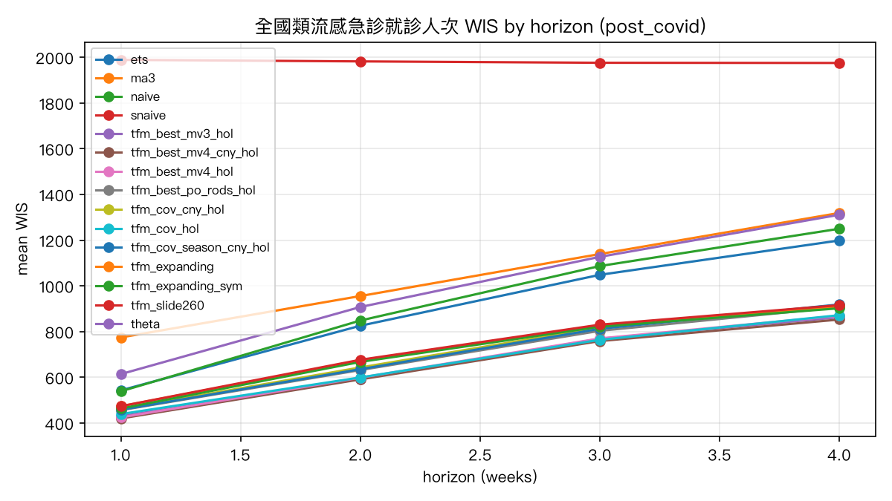
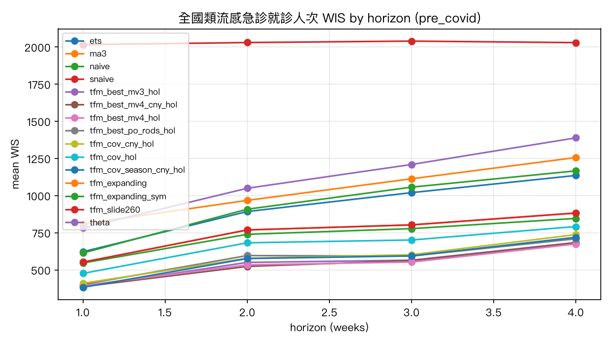
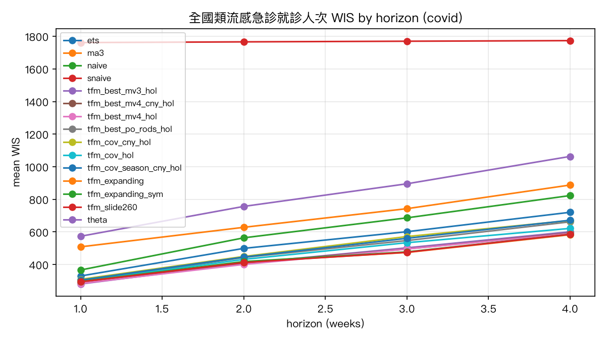
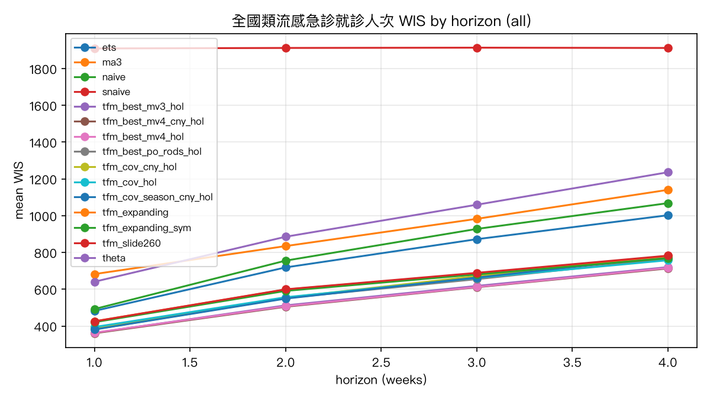
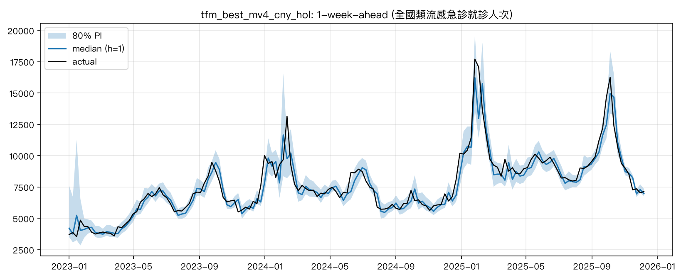
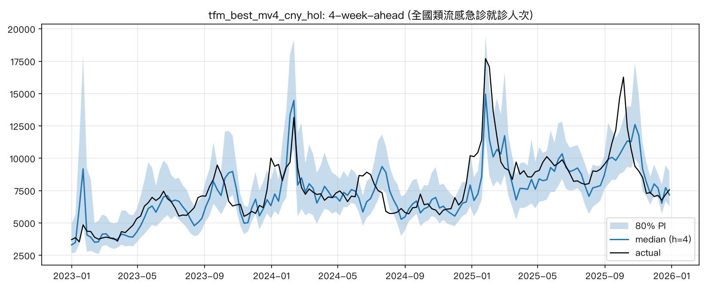
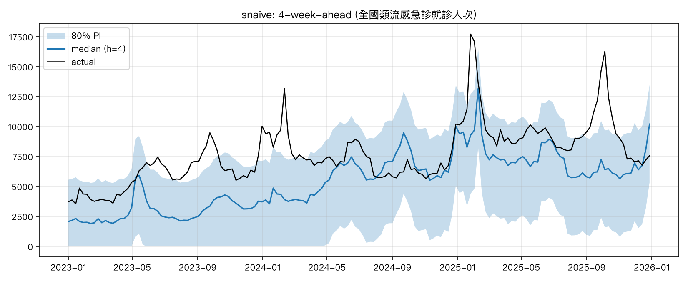

# 回測報告：全國類流感急診就診人次

- 目標序列：`nhi_er_ili`；資料窗 2016w01–2025w53；起點 415 個（最後 context 週 201752–202549）；h = 1–4
- 分段：COVID 前 = 目標週落在 2018–2019、COVID 期 = 2020–2022、COVID 後 = 2023–2025
- WIS 越低越好；rel_wis = 相對季節性 naive 的 WIS（< 1 表示優於季節性 naive）；mape 為百分比；cov80 / cov60 = 80% / 60% 區間涵蓋率（理想 0.80 / 0.60）

## COVID 後（2023–2025，主要決策依據）：h = 1–4 平均

| config                 |      wis |      mae |   mape |   mase |   cov80 |   cov60 |   rel_wis |
|:-----------------------|---------:|---------:|-------:|-------:|--------:|--------:|----------:|
| tfm_best_mv4_cny_hol   |  655.649 |  834.857 | 10.448 |  0.31  |   0.813 |   0.593 |     0.331 |
| tfm_best_mv3_hol       |  663.661 |  852.594 | 10.664 |  0.317 |   0.801 |   0.558 |     0.335 |
| tfm_best_mv4_hol       |  665.751 |  854.947 | 10.562 |  0.318 |   0.807 |   0.575 |     0.336 |
| tfm_cov_hol            |  668.71  |  862.592 | 10.604 |  0.321 |   0.799 |   0.579 |     0.338 |
| tfm_best_po_rods_hol   |  699.658 |  903.624 | 11.206 |  0.336 |   0.802 |   0.574 |     0.353 |
| tfm_cov_season_cny_hol |  706.212 |  911.08  | 11.314 |  0.339 |   0.815 |   0.575 |     0.357 |
| tfm_cov_cny_hol        |  709.72  |  907.962 | 11.371 |  0.338 |   0.791 |   0.558 |     0.359 |
| tfm_expanding_sym      |  713.753 |  891.518 | 10.593 |  0.331 |   0.86  |   0.657 |     0.361 |
| tfm_expanding          |  719.655 |  893.868 | 10.647 |  0.332 |   0.825 |   0.625 |     0.364 |
| tfm_slide260           |  724.146 |  904.395 | 10.686 |  0.336 |   0.796 |   0.59  |     0.366 |
| ets                    |  904.016 | 1098.02  | 13.09  |  0.409 |   0.915 |   0.773 |     0.457 |
| naive                  |  931.071 | 1096.88  | 13.073 |  0.408 |   0.77  |   0.484 |     0.47  |
| theta                  |  990.054 | 1112.82  | 13.272 |  0.414 |   0.892 |   0.806 |     0.5   |
| ma3                    | 1047.17  | 1243.2   | 14.891 |  0.463 |   0.754 |   0.455 |     0.529 |
| snaive                 | 1980.61  | 2542.59  | 33.28  |  0.945 |   0.719 |   0.503 |     1     |

### WIS 依 horizon（post_covid）

| config                 |    1 |    2 |    3 |    4 |
|:-----------------------|-----:|-----:|-----:|-----:|
| tfm_best_mv4_cny_hol   |  420 |  591 |  759 |  853 |
| tfm_best_mv4_hol       |  425 |  599 |  770 |  869 |
| tfm_best_mv3_hol       |  430 |  593 |  769 |  863 |
| tfm_cov_hol            |  439 |  600 |  764 |  872 |
| tfm_best_po_rods_hol   |  456 |  632 |  803 |  907 |
| tfm_cov_season_cny_hol |  458 |  636 |  812 |  919 |
| tfm_cov_cny_hol        |  461 |  643 |  818 |  916 |
| tfm_expanding_sym      |  464 |  667 |  822 |  902 |
| tfm_expanding          |  474 |  672 |  823 |  910 |
| tfm_slide260           |  474 |  677 |  830 |  916 |
| naive                  |  539 |  849 | 1087 | 1250 |
| ets                    |  543 |  826 | 1048 | 1199 |
| theta                  |  614 |  908 | 1127 | 1311 |
| ma3                    |  775 |  956 | 1139 | 1319 |
| snaive                 | 1989 | 1982 | 1976 | 1975 |

## COVID 前（2018–2019）：h = 1–4 平均

| config                 |      wis |      mae |   mape |   mase |   cov80 |   cov60 |   rel_wis |
|:-----------------------|---------:|---------:|-------:|-------:|--------:|--------:|----------:|
| tfm_best_mv4_cny_hol   |  538.575 |  695.416 |  9.965 |  0.194 |   0.837 |   0.561 |     0.265 |
| tfm_best_mv4_hol       |  538.619 |  697.026 |  9.852 |  0.194 |   0.805 |   0.54  |     0.265 |
| tfm_best_mv3_hol       |  546.445 |  700.95  |  9.946 |  0.196 |   0.808 |   0.537 |     0.269 |
| tfm_cov_season_cny_hol |  567.995 |  729.767 | 10.238 |  0.203 |   0.83  |   0.591 |     0.28  |
| tfm_best_po_rods_hol   |  575.001 |  731.173 | 10.301 |  0.204 |   0.822 |   0.566 |     0.283 |
| tfm_cov_cny_hol        |  581.899 |  741.368 | 10.617 |  0.206 |   0.801 |   0.542 |     0.287 |
| tfm_cov_hol            |  662.882 |  852.525 | 11.763 |  0.235 |   0.813 |   0.566 |     0.327 |
| tfm_expanding_sym      |  727.455 |  888.632 | 11.688 |  0.246 |   0.864 |   0.688 |     0.358 |
| tfm_expanding          |  751.523 |  910.132 | 12.041 |  0.253 |   0.847 |   0.649 |     0.37  |
| tfm_slide260           |  751.523 |  910.132 | 12.041 |  0.253 |   0.847 |   0.649 |     0.37  |
| ets                    |  917.494 | 1061.66  | 14.032 |  0.291 |   0.91  |   0.834 |     0.452 |
| naive                  |  936.259 | 1060.91  | 14.021 |  0.291 |   0.888 |   0.664 |     0.461 |
| ma3                    | 1036.43  | 1188.09  | 16.079 |  0.325 |   0.871 |   0.671 |     0.511 |
| theta                  | 1107.35  | 1089.77  | 14.477 |  0.299 |   0.939 |   0.88  |     0.546 |
| snaive                 | 2028.58  | 2495.3   | 36.434 |  0.683 |   0.902 |   0.678 |     1     |

### WIS 依 horizon（pre_covid）

| config                 |    1 |    2 |    3 |    4 |
|:-----------------------|-----:|-----:|-----:|-----:|
| tfm_cov_season_cny_hol |  383 |  576 |  594 |  719 |
| tfm_best_mv3_hol       |  386 |  550 |  565 |  685 |
| tfm_best_mv4_cny_hol   |  387 |  523 |  562 |  682 |
| tfm_best_mv4_hol       |  394 |  534 |  553 |  674 |
| tfm_best_po_rods_hol   |  401 |  596 |  593 |  709 |
| tfm_cov_cny_hol        |  410 |  578 |  602 |  737 |
| tfm_cov_hol            |  476 |  682 |  701 |  792 |
| tfm_expanding_sym      |  546 |  739 |  778 |  847 |
| tfm_expanding          |  552 |  769 |  803 |  883 |
| tfm_slide260           |  552 |  769 |  803 |  883 |
| naive                  |  614 |  908 | 1057 | 1166 |
| ets                    |  622 |  893 | 1020 | 1135 |
| theta                  |  782 | 1049 | 1209 | 1389 |
| ma3                    |  809 |  968 | 1113 | 1256 |
| snaive                 | 2015 | 2030 | 2040 | 2029 |

## COVID 期（2020–2022）：h = 1–4 平均

| config                 |      wis |      mae |   mape |   mase |   cov80 |   cov60 |   rel_wis |
|:-----------------------|---------:|---------:|-------:|-------:|--------:|--------:|----------:|
| tfm_expanding          |  441.542 |  542.644 | 14.379 |  0.177 |   0.783 |   0.564 |     0.25  |
| tfm_slide260           |  441.772 |  541.61  | 14.44  |  0.176 |   0.761 |   0.564 |     0.25  |
| tfm_best_mv4_hol       |  442.374 |  537.002 | 16.063 |  0.174 |   0.764 |   0.549 |     0.25  |
| tfm_expanding_sym      |  444.208 |  546.196 | 14.632 |  0.178 |   0.791 |   0.591 |     0.251 |
| tfm_best_mv4_cny_hol   |  445.406 |  539.263 | 16.25  |  0.175 |   0.768 |   0.584 |     0.252 |
| tfm_best_mv3_hol       |  447.825 |  548.61  | 16.632 |  0.177 |   0.775 |   0.568 |     0.253 |
| tfm_cov_hol            |  470.925 |  571.623 | 17.515 |  0.185 |   0.768 |   0.556 |     0.266 |
| tfm_best_po_rods_hol   |  487.188 |  600.511 | 18.093 |  0.194 |   0.758 |   0.54  |     0.275 |
| tfm_cov_season_cny_hol |  495.637 |  611.924 | 18.431 |  0.197 |   0.75  |   0.514 |     0.28  |
| tfm_cov_cny_hol        |  500.092 |  610.055 | 18.602 |  0.197 |   0.729 |   0.497 |     0.283 |
| ets                    |  537.64  |  651.505 | 17.189 |  0.212 |   0.892 |   0.769 |     0.304 |
| naive                  |  609.929 |  649.96  | 17.136 |  0.212 |   0.903 |   0.783 |     0.345 |
| ma3                    |  691.769 |  735.964 | 19.822 |  0.24  |   0.909 |   0.766 |     0.391 |
| theta                  |  822.114 |  670.848 | 17.687 |  0.219 |   0.951 |   0.916 |     0.465 |
| snaive                 | 1767.63  | 2363.55  | 82.403 |  0.751 |   0.9   |   0.697 |     1     |

### WIS 依 horizon（covid）

| config                 |    1 |    2 |    3 |    4 |
|:-----------------------|-----:|-----:|-----:|-----:|
| tfm_best_mv3_hol       |  281 |  407 |  502 |  601 |
| tfm_best_mv4_hol       |  284 |  401 |  495 |  590 |
| tfm_best_mv4_cny_hol   |  285 |  408 |  495 |  594 |
| tfm_slide260           |  294 |  412 |  475 |  585 |
| tfm_expanding          |  295 |  414 |  474 |  583 |
| tfm_expanding_sym      |  296 |  418 |  477 |  585 |
| tfm_best_po_rods_hol   |  296 |  444 |  547 |  662 |
| tfm_cov_hol            |  297 |  432 |  534 |  622 |
| tfm_cov_season_cny_hol |  304 |  446 |  561 |  672 |
| tfm_cov_cny_hol        |  309 |  450 |  572 |  670 |
| ets                    |  330 |  499 |  601 |  720 |
| naive                  |  366 |  564 |  686 |  823 |
| ma3                    |  509 |  628 |  743 |  888 |
| theta                  |  573 |  757 |  895 | 1063 |
| snaive                 | 1761 | 1766 | 1770 | 1773 |

## 全期（2018–2025）：h = 1–4 平均

| config                 |      wis |      mae |   mape |   mase |   cov80 |   cov60 |   rel_wis |
|:-----------------------|---------:|---------:|-------:|-------:|--------:|--------:|----------:|
| tfm_best_mv4_cny_hol   |  547.358 |  688.796 | 12.524 |  0.23  |   0.802 |   0.582 |     0.286 |
| tfm_best_mv4_hol       |  550.039 |  695.925 | 12.469 |  0.233 |   0.79  |   0.557 |     0.288 |
| tfm_best_mv3_hol       |  553.226 |  700.368 | 12.746 |  0.234 |   0.793 |   0.557 |     0.289 |
| tfm_best_po_rods_hol   |  588.67  |  746.626 | 13.589 |  0.25  |   0.79  |   0.559 |     0.308 |
| tfm_cov_season_cny_hol |  592.571 |  753.35  | 13.742 |  0.252 |   0.794 |   0.556 |     0.31  |
| tfm_cov_hol            |  592.596 |  750.195 | 13.505 |  0.248 |   0.79  |   0.567 |     0.31  |
| tfm_cov_cny_hol        |  599.006 |  754.35  | 13.921 |  0.252 |   0.77  |   0.531 |     0.313 |
| tfm_expanding_sym      |  615.325 |  760.328 | 12.392 |  0.252 |   0.835 |   0.64  |     0.322 |
| tfm_expanding          |  622.443 |  765.154 | 12.403 |  0.254 |   0.814 |   0.608 |     0.326 |
| tfm_slide260           |  624.218 |  768.716 | 12.44  |  0.255 |   0.795 |   0.595 |     0.326 |
| ets                    |  768.898 |  920.346 | 14.874 |  0.305 |   0.905 |   0.787 |     0.402 |
| naive                  |  811.03  |  919.148 | 14.845 |  0.305 |   0.849 |   0.642 |     0.424 |
| ma3                    |  910.164 | 1037.85  | 17.05  |  0.345 |   0.842 |   0.626 |     0.476 |
| theta                  |  955.59  |  940.143 | 15.24  |  0.312 |   0.926 |   0.866 |     0.5   |
| snaive                 | 1911.86  | 2463.2   | 52.642 |  0.807 |   0.833 |   0.62  |     1     |

### WIS 依 horizon（all）

| config                 |    1 |    2 |    3 |    4 |
|:-----------------------|-----:|-----:|-----:|-----:|
| tfm_best_mv4_cny_hol   |  361 |  505 |  611 |  713 |
| tfm_best_mv3_hol       |  362 |  512 |  618 |  720 |
| tfm_best_mv4_hol       |  364 |  508 |  613 |  716 |
| tfm_cov_season_cny_hol |  381 |  549 |  663 |  777 |
| tfm_best_po_rods_hol   |  382 |  552 |  655 |  766 |
| tfm_cov_cny_hol        |  391 |  554 |  672 |  780 |
| tfm_cov_hol            |  395 |  557 |  662 |  758 |
| tfm_expanding_sym      |  421 |  591 |  681 |  769 |
| tfm_slide260           |  425 |  600 |  689 |  783 |
| tfm_expanding          |  426 |  598 |  686 |  780 |
| ets                    |  482 |  719 |  872 | 1002 |
| naive                  |  492 |  756 |  928 | 1068 |
| theta                  |  641 |  886 | 1060 | 1236 |
| ma3                    |  683 |  835 |  983 | 1141 |
| snaive                 | 1909 | 1912 | 1914 | 1912 |

## 各年 WIS（h = 1 與 h = 4）

### h = 1

| config                 |   2018 |   2019 |   2020 |   2021 |   2022 |   2023 |   2024 |   2025 |
|:-----------------------|-------:|-------:|-------:|-------:|-------:|-------:|-------:|-------:|
| ets                    |    571 |    673 |    497 |    261 |    228 |    345 |    536 |    756 |
| ma3                    |    816 |    802 |    769 |    373 |    379 |    456 |    641 |   1245 |
| naive                  |    582 |    645 |    562 |    295 |    238 |    325 |    521 |    780 |
| snaive                 |   2344 |   1687 |   2754 |   1634 |    877 |   2055 |   1802 |   2114 |
| tfm_best_mv3_hol       |    410 |    361 |    289 |    298 |    255 |    301 |    451 |    542 |
| tfm_best_mv4_cny_hol   |    422 |    352 |    297 |    279 |    279 |    291 |    455 |    518 |
| tfm_best_mv4_hol       |    414 |    373 |    293 |    284 |    274 |    293 |    450 |    536 |
| tfm_best_po_rods_hol   |    432 |    371 |    315 |    313 |    261 |    312 |    481 |    581 |
| tfm_cov_cny_hol        |    437 |    383 |    327 |    315 |    286 |    326 |    482 |    580 |
| tfm_cov_hol            |    505 |    447 |    362 |    251 |    275 |    301 |    465 |    556 |
| tfm_cov_season_cny_hol |    411 |    354 |    336 |    311 |    265 |    317 |    480 |    582 |
| tfm_expanding          |    524 |    580 |    448 |    233 |    202 |    310 |    492 |    625 |
| tfm_expanding_sym      |    511 |    582 |    444 |    235 |    206 |    311 |    487 |    598 |
| tfm_slide260           |    524 |    580 |    448 |    229 |    202 |    303 |    494 |    630 |
| theta                  |    756 |    809 |    785 |    490 |    442 |    441 |    592 |    817 |

### h = 4

| config                 |   2018 |   2019 |   2020 |   2021 |   2022 |   2023 |   2024 |   2025 |
|:-----------------------|-------:|-------:|-------:|-------:|-------:|-------:|-------:|-------:|
| ets                    |   1007 |   1257 |   1013 |    539 |    603 |    750 |   1005 |   1830 |
| ma3                    |   1230 |   1280 |   1319 |    645 |    691 |    842 |    997 |   2103 |
| naive                  |   1120 |   1210 |   1192 |    616 |    654 |    784 |    987 |   1965 |
| snaive                 |   2378 |   1701 |   2783 |   1634 |    884 |   2054 |   1809 |   2061 |
| tfm_best_mv3_hol       |    572 |    791 |    675 |    559 |    568 |    650 |    809 |   1124 |
| tfm_best_mv4_cny_hol   |    595 |    763 |    648 |    523 |    609 |    636 |    804 |   1114 |
| tfm_best_mv4_hol       |    605 |    739 |    650 |    534 |    585 |    629 |    815 |   1158 |
| tfm_best_po_rods_hol   |    597 |    814 |    762 |    640 |    581 |    686 |    847 |   1182 |
| tfm_cov_cny_hol        |    662 |    809 |    713 |    690 |    606 |    698 |    813 |   1232 |
| tfm_cov_hol            |    740 |    840 |    720 |    583 |    560 |    644 |    811 |   1155 |
| tfm_cov_season_cny_hol |    654 |    781 |    749 |    664 |    601 |    699 |    835 |   1216 |
| tfm_expanding          |    724 |   1033 |    782 |    461 |    502 |    642 |    915 |   1169 |
| tfm_expanding_sym      |    691 |    993 |    775 |    467 |    511 |    639 |    876 |   1186 |
| tfm_slide260           |    724 |   1033 |    782 |    477 |    494 |    584 |    868 |   1288 |
| theta                  |   1359 |   1417 |   1430 |    874 |    878 |    928 |   1074 |   1921 |

## 命中率（hit rate）

定義：`dir_hit` = 方向命中率（中位數相對起點週的漲/跌方向與實際一致）；`dir_hit3` = 三分類（漲 / 持平 / 跌，±5% 為持平帶）命中率；`hit_tol10` = 中位數落在實際值 ±10% 內的比例；`hit80` = 實際值落在 q10–q90 內的比例（= 80% 涵蓋率）；`thr_hit_rate` = 閾值命中率（敏感度：實際 ≥ 閾值的週中，中位數也 ≥ 閾值的比例），`thr_false_alarm` = 誤報率，`thr_accuracy` = 整體準確率；閾值 = 7,514.0（資料窗內實際值第 75 百分位）。
last-value naive 的中位數等於起點值，方向命中率因此退化（永遠不預測上漲、三分類永遠預測持平），僅供對照。

### COVID 後（2023–2025，主要決策依據）：h = 1–4 平均

| config                 |   dir_hit |   dir_hit3 |   hit_tol10 |   hit80 |   thr_hit_rate |   thr_false_alarm |   thr_accuracy |
|:-----------------------|----------:|-----------:|------------:|--------:|---------------:|------------------:|---------------:|
| tfm_best_mv4_cny_hol   |     0.72  |      0.543 |       0.617 |   0.813 |          0.835 |             0.117 |          0.862 |
| tfm_best_mv3_hol       |     0.698 |      0.522 |       0.592 |   0.801 |          0.832 |             0.126 |          0.856 |
| tfm_best_mv4_hol       |     0.695 |      0.517 |       0.61  |   0.807 |          0.836 |             0.117 |          0.862 |
| tfm_cov_hol            |     0.701 |      0.492 |       0.586 |   0.799 |          0.835 |             0.114 |          0.864 |
| tfm_best_po_rods_hol   |     0.669 |      0.506 |       0.567 |   0.802 |          0.824 |             0.117 |          0.857 |
| tfm_cov_season_cny_hol |     0.675 |      0.476 |       0.567 |   0.815 |          0.832 |             0.131 |          0.853 |
| tfm_cov_cny_hol        |     0.686 |      0.469 |       0.585 |   0.791 |          0.843 |             0.128 |          0.859 |
| tfm_expanding_sym      |     0.691 |      0.479 |       0.585 |   0.86  |          0.846 |             0.131 |          0.859 |
| tfm_expanding          |     0.678 |      0.477 |       0.578 |   0.825 |          0.846 |             0.143 |          0.853 |
| tfm_slide260           |     0.667 |      0.452 |       0.591 |   0.796 |          0.832 |             0.12  |          0.859 |
| ets                    |     0.482 |      0.322 |       0.532 |   0.915 |          0.846 |             0.117 |          0.867 |
| naive                  |     0.478 |      0.322 |       0.532 |   0.77  |          0.846 |             0.117 |          0.867 |
| theta                  |     0.394 |      0.322 |       0.524 |   0.892 |          0.832 |             0.129 |          0.854 |
| ma3                    |     0.4   |      0.307 |       0.462 |   0.754 |          0.81  |             0.16  |          0.827 |
| snaive                 |     0.563 |      0.379 |       0.185 |   0.719 |          0.238 |             0.063 |          0.63  |

方向命中率依 horizon（post_covid）：

| config                 |     1 |     2 |     3 |     4 |
|:-----------------------|------:|------:|------:|------:|
| tfm_best_mv4_cny_hol   | 0.688 | 0.729 | 0.744 | 0.72  |
| tfm_best_mv3_hol       | 0.669 | 0.716 | 0.712 | 0.694 |
| tfm_best_mv4_hol       | 0.675 | 0.703 | 0.724 | 0.675 |
| tfm_cov_hol            | 0.649 | 0.716 | 0.724 | 0.713 |
| tfm_best_po_rods_hol   | 0.604 | 0.697 | 0.686 | 0.688 |
| tfm_cov_season_cny_hol | 0.604 | 0.69  | 0.686 | 0.72  |
| tfm_cov_cny_hol        | 0.617 | 0.69  | 0.712 | 0.726 |
| tfm_expanding_sym      | 0.623 | 0.69  | 0.712 | 0.739 |
| tfm_expanding          | 0.597 | 0.703 | 0.692 | 0.72  |
| tfm_slide260           | 0.571 | 0.639 | 0.718 | 0.739 |
| ets                    | 0.487 | 0.503 | 0.487 | 0.452 |
| naive                  | 0.494 | 0.49  | 0.468 | 0.459 |
| theta                  | 0.435 | 0.381 | 0.378 | 0.382 |
| ma3                    | 0.396 | 0.4   | 0.391 | 0.414 |
| snaive                 | 0.539 | 0.561 | 0.583 | 0.567 |

### 全期（2018–2025）：h = 1–4 平均

| config                 |   dir_hit |   dir_hit3 |   hit_tol10 |   hit80 |   thr_hit_rate |   thr_false_alarm |   thr_accuracy |
|:-----------------------|----------:|-----------:|------------:|--------:|---------------:|------------------:|---------------:|
| tfm_best_mv4_cny_hol   |     0.681 |      0.516 |       0.601 |   0.802 |          0.807 |             0.059 |          0.908 |
| tfm_best_mv4_hol       |     0.669 |      0.506 |       0.602 |   0.79  |          0.797 |             0.055 |          0.908 |
| tfm_best_mv3_hol       |     0.663 |      0.505 |       0.586 |   0.793 |          0.797 |             0.055 |          0.908 |
| tfm_best_po_rods_hol   |     0.651 |      0.493 |       0.572 |   0.79  |          0.792 |             0.055 |          0.907 |
| tfm_cov_season_cny_hol |     0.654 |      0.472 |       0.569 |   0.794 |          0.797 |             0.058 |          0.906 |
| tfm_cov_hol            |     0.66  |      0.486 |       0.562 |   0.79  |          0.795 |             0.061 |          0.903 |
| tfm_cov_cny_hol        |     0.65  |      0.479 |       0.57  |   0.77  |          0.807 |             0.064 |          0.904 |
| tfm_expanding_sym      |     0.639 |      0.469 |       0.584 |   0.835 |          0.787 |             0.051 |          0.909 |
| tfm_expanding          |     0.636 |      0.472 |       0.581 |   0.814 |          0.797 |             0.059 |          0.905 |
| tfm_slide260           |     0.625 |      0.451 |       0.577 |   0.795 |          0.787 |             0.053 |          0.907 |
| ets                    |     0.477 |      0.315 |       0.544 |   0.905 |          0.799 |             0.071 |          0.897 |
| naive                  |     0.481 |      0.315 |       0.543 |   0.849 |          0.799 |             0.071 |          0.897 |
| ma3                    |     0.42  |      0.319 |       0.481 |   0.842 |          0.744 |             0.095 |          0.865 |
| theta                  |     0.392 |      0.323 |       0.533 |   0.926 |          0.78  |             0.074 |          0.89  |
| snaive                 |     0.573 |      0.397 |       0.13  |   0.833 |          0.263 |             0.133 |          0.716 |

方向命中率依 horizon（all）：

| config                 |     1 |     2 |     3 |     4 |
|:-----------------------|------:|------:|------:|------:|
| tfm_best_mv4_cny_hol   | 0.665 | 0.677 | 0.706 | 0.675 |
| tfm_best_mv4_hol       | 0.651 | 0.66  | 0.701 | 0.665 |
| tfm_best_mv3_hol       | 0.643 | 0.665 | 0.68  | 0.665 |
| tfm_best_po_rods_hol   | 0.612 | 0.651 | 0.675 | 0.667 |
| tfm_cov_season_cny_hol | 0.607 | 0.658 | 0.67  | 0.68  |
| tfm_cov_hol            | 0.624 | 0.655 | 0.684 | 0.675 |
| tfm_cov_cny_hol        | 0.612 | 0.646 | 0.675 | 0.667 |
| tfm_expanding_sym      | 0.595 | 0.643 | 0.648 | 0.667 |
| tfm_expanding          | 0.581 | 0.663 | 0.636 | 0.665 |
| tfm_slide260           | 0.569 | 0.643 | 0.639 | 0.651 |
| ets                    | 0.501 | 0.504 | 0.465 | 0.439 |
| naive                  | 0.492 | 0.489 | 0.465 | 0.48  |
| ma3                    | 0.446 | 0.424 | 0.393 | 0.417 |
| theta                  | 0.46  | 0.39  | 0.349 | 0.369 |
| snaive                 | 0.537 | 0.566 | 0.593 | 0.595 |

## 診斷：偏差與 MAPE（最佳設定 vs 基準）

### 平均帶號偏差 %（中位數 − 實際）/ 實際；正值 = 高估

|                                        |     1 |     2 |     3 |     4 |
|:---------------------------------------|------:|------:|------:|------:|
| ('ma3', 'covid')                       |   3.7 |   5.1 |   7   |   9.6 |
| ('ma3', 'post_covid')                  |   0.4 |   0.5 |   0.7 |   0.9 |
| ('ma3', 'pre_covid')                   |   1.4 |   2.2 |   3.1 |   4.8 |
| ('naive', 'covid')                     |   1.6 |   3.7 |   5.8 |   7.9 |
| ('naive', 'post_covid')                |   0.1 |   0.4 |   0.6 |   0.7 |
| ('naive', 'pre_covid')                 |   0.8 |   1.8 |   2.6 |   4   |
| ('snaive', 'covid')                    |  61.5 |  61.5 |  61.5 |  61.5 |
| ('snaive', 'post_covid')               | -30   | -29.8 | -29.6 | -29.1 |
| ('snaive', 'pre_covid')                |  -0.7 |  -0.3 |   0.1 |   0.6 |
| ('tfm_best_mv4_cny_hol', 'covid')      |   3.1 |   5.1 |   7.1 |   8.2 |
| ('tfm_best_mv4_cny_hol', 'post_covid') |  -0.9 |  -1.2 |  -1.6 |  -2.3 |
| ('tfm_best_mv4_cny_hol', 'pre_covid')  |  -0.1 |   0.7 |   0.1 |  -0.5 |

### MAPE %

|                                        |    1 |    2 |    3 |    4 |
|:---------------------------------------|-----:|-----:|-----:|-----:|
| ('ma3', 'covid')                       | 13.5 | 17.2 | 21.4 | 27.1 |
| ('ma3', 'post_covid')                  | 10.7 | 13.4 | 16.2 | 19.3 |
| ('ma3', 'pre_covid')                   | 11.8 | 14.5 | 17.4 | 20.6 |
| ('naive', 'covid')                     |  9.6 | 14.9 | 19.5 | 24.5 |
| ('naive', 'post_covid')                |  7.4 | 11.6 | 15.3 | 18   |
| ('naive', 'pre_covid')                 |  8.5 | 12.9 | 16   | 18.7 |
| ('snaive', 'covid')                    | 82.4 | 82.4 | 82.4 | 82.4 |
| ('snaive', 'post_covid')               | 33.5 | 33.3 | 33.2 | 33.2 |
| ('snaive', 'pre_covid')                | 36.5 | 36.5 | 36.5 | 36.3 |
| ('tfm_best_mv4_cny_hol', 'covid')      | 10.4 | 14.8 | 18.3 | 21.5 |
| ('tfm_best_mv4_cny_hol', 'post_covid') |  6.7 |  9.6 | 12.1 | 13.5 |
| ('tfm_best_mv4_cny_hol', 'pre_covid')  |  6.5 |  9.6 | 10.6 | 13.1 |

### COVID 後高流行週（實際值 ≥ 第 75 百分位 9,038；39 週）

WIS：

| config                 |    1 |    2 |    3 |    4 |
|:-----------------------|-----:|-----:|-----:|-----:|
| ets                    | 1043 | 1623 | 2035 | 2163 |
| ma3                    | 1630 | 1965 | 2264 | 2399 |
| naive                  | 1145 | 1814 | 2251 | 2359 |
| snaive                 | 3159 | 3162 | 3164 | 3166 |
| tfm_best_mv3_hol       |  769 | 1040 | 1432 | 1518 |
| tfm_best_mv4_cny_hol   |  765 | 1038 | 1428 | 1522 |
| tfm_best_mv4_hol       |  780 | 1093 | 1490 | 1580 |
| tfm_best_po_rods_hol   |  834 | 1123 | 1515 | 1615 |
| tfm_cov_cny_hol        |  854 | 1156 | 1568 | 1670 |
| tfm_cov_hol            |  796 | 1067 | 1432 | 1554 |
| tfm_cov_season_cny_hol |  842 | 1144 | 1554 | 1659 |
| tfm_expanding          |  945 | 1317 | 1549 | 1577 |
| tfm_expanding_sym      |  900 | 1287 | 1561 | 1598 |
| tfm_slide260           |  965 | 1393 | 1689 | 1772 |
| theta                  | 1100 | 1745 | 2124 | 2243 |

偏差 %：

| config                 |     1 |     2 |     3 |     4 |
|:-----------------------|------:|------:|------:|------:|
| ets                    |  -1   |  -2.7 |  -5.4 |  -8.1 |
| ma3                    |  -3.1 |  -4.6 |  -7.1 | -10.8 |
| naive                  |  -1   |  -2.8 |  -5.5 |  -8.2 |
| snaive                 | -34.9 | -34.9 | -34.9 | -34.9 |
| tfm_best_mv3_hol       |  -3.5 |  -5   |  -8.2 | -10.4 |
| tfm_best_mv4_cny_hol   |  -3.2 |  -4.9 |  -8.2 | -10.4 |
| tfm_best_mv4_hol       |  -4   |  -6   |  -9.2 | -11.3 |
| tfm_best_po_rods_hol   |  -4   |  -5.3 |  -8.6 | -10.4 |
| tfm_cov_cny_hol        |  -4.3 |  -6.2 |  -9.7 | -12.4 |
| tfm_cov_hol            |  -4.1 |  -6.1 |  -9.1 | -12.1 |
| tfm_cov_season_cny_hol |  -4.2 |  -5.6 |  -8.7 | -10.8 |
| tfm_expanding          |  -4.4 |  -7.6 | -11   | -13.7 |
| tfm_expanding_sym      |  -4.1 |  -7.8 | -12   | -15.1 |
| tfm_slide260           |  -5   |  -8.8 | -12.6 | -15.3 |
| theta                  |  -1.3 |  -3.2 |  -5.9 |  -8.6 |

## 最佳設定 `tfm_best_mv4_cny_hol` 的 1 週前預測 vs 實際（2023 起）

## 最佳設定 `tfm_best_mv4_cny_hol` 的 4 週前預測 vs 實際（2023 起）

## 對照：季節性 naive 的 4 週前預測

