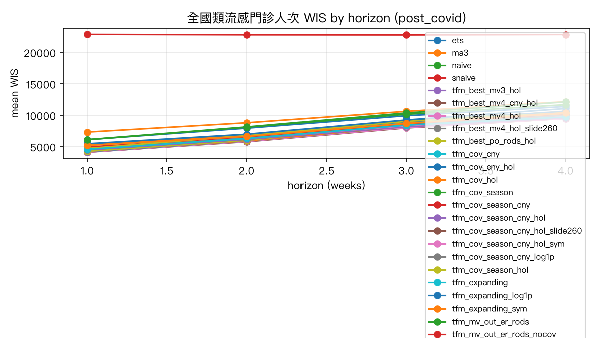
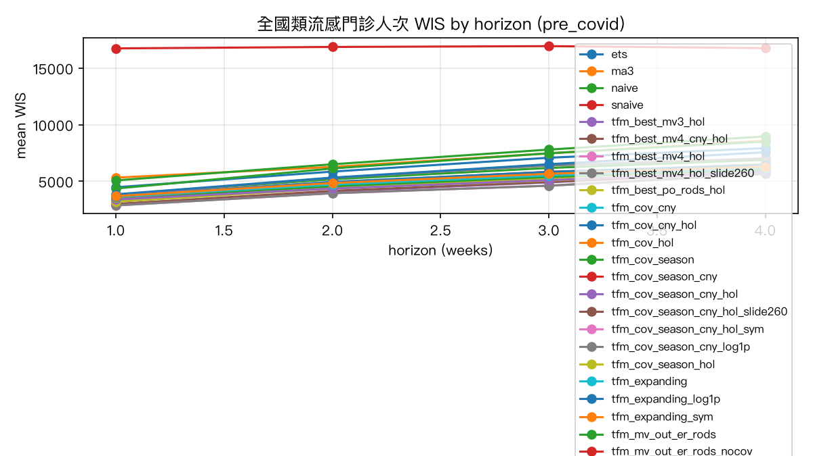
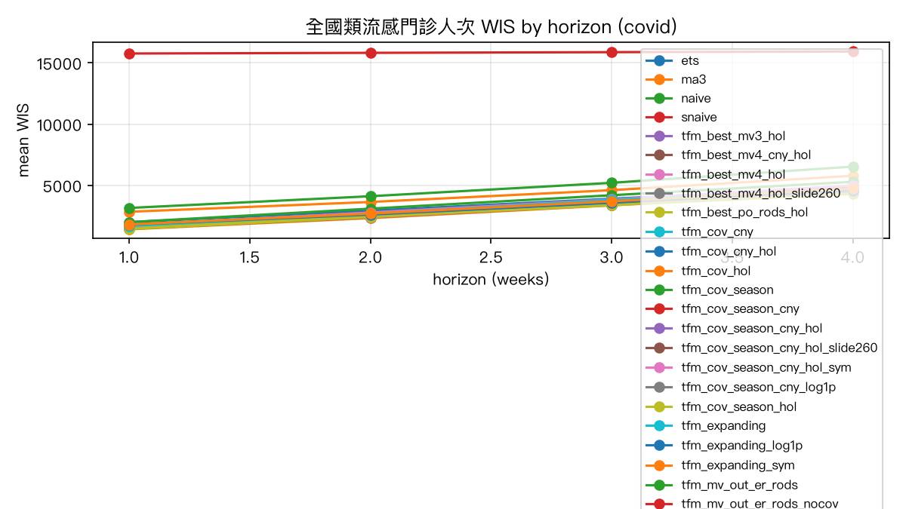
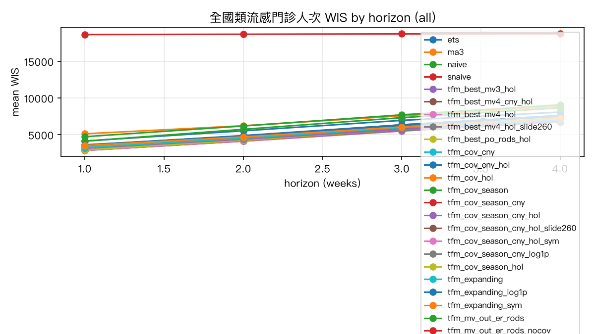
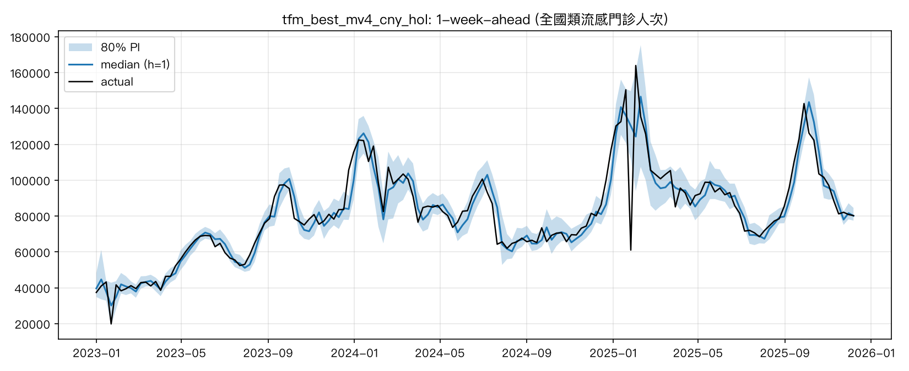
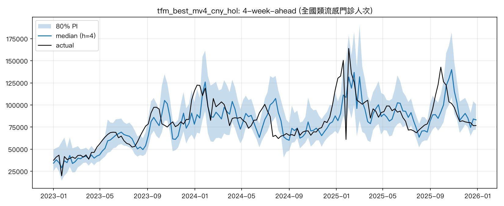
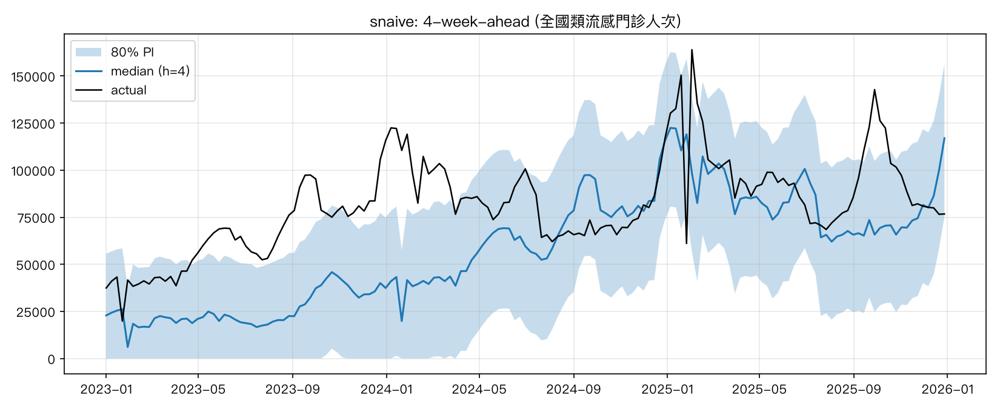

# 回測報告：全國類流感門診人次

- 目標序列：`nhi_out_ili`；資料窗 2016w01–2025w53；起點 415 個（最後 context 週 201752–202549）；h = 1–4
- 分段：COVID 前 = 目標週落在 2018–2019、COVID 期 = 2020–2022、COVID 後 = 2023–2025
- WIS 越低越好；rel_wis = 相對季節性 naive 的 WIS（< 1 表示優於季節性 naive）；mape 為百分比；cov80 / cov60 = 80% / 60% 區間涵蓋率（理想 0.80 / 0.60）

## COVID 後（2023–2025，主要決策依據）：h = 1–4 平均

| config                          |      wis |      mae |   mape |   mase |   cov80 |   cov60 |   rel_wis |
|:--------------------------------|---------:|---------:|-------:|-------:|--------:|--------:|----------:|
| tfm_best_mv4_cny_hol            |  6857.13 |  8725.37 | 10.469 |  0.346 |   0.817 |   0.616 |     0.3   |
| tfm_best_mv4_hol                |  6886    |  8829.5  | 10.616 |  0.35  |   0.815 |   0.611 |     0.301 |
| tfm_best_mv3_hol                |  6909.58 |  8853.51 | 10.609 |  0.351 |   0.799 |   0.577 |     0.302 |
| tfm_best_po_rods_hol            |  7005.01 |  8976.41 | 10.93  |  0.356 |   0.805 |   0.604 |     0.307 |
| tfm_cov_cny_hol                 |  7065.23 |  9043.84 | 10.864 |  0.359 |   0.794 |   0.579 |     0.309 |
| tfm_cov_hol                     |  7109.29 |  9036.61 | 10.767 |  0.358 |   0.788 |   0.58  |     0.311 |
| tfm_best_mv4_hol_slide260       |  7115.93 |  9034.11 | 10.672 |  0.358 |   0.818 |   0.595 |     0.312 |
| tfm_mv_out_er_rods_sev          |  7120.02 |  9167.76 | 11.178 |  0.364 |   0.825 |   0.591 |     0.312 |
| tfm_mv_out_er_rods              |  7144.25 |  9199.78 | 11.251 |  0.365 |   0.8   |   0.569 |     0.313 |
| tfm_cov_season_cny_hol          |  7229.99 |  9295.2  | 11.181 |  0.368 |   0.807 |   0.6   |     0.317 |
| tfm_cov_season_hol              |  7259.53 |  9264.81 | 11.133 |  0.367 |   0.815 |   0.616 |     0.318 |
| tfm_cov_season_cny_hol_sym      |  7262.33 |  9419.82 | 11.304 |  0.373 |   0.82  |   0.612 |     0.318 |
| tfm_po_rods                     |  7274.79 |  9305.75 | 11.483 |  0.369 |   0.813 |   0.59  |     0.318 |
| tfm_cov_cny                     |  7283.63 |  9346.06 | 11.379 |  0.371 |   0.796 |   0.566 |     0.319 |
| tfm_po_all_lag2                 |  7321.32 |  9283.05 | 11.364 |  0.368 |   0.836 |   0.616 |     0.32  |
| tfm_po_all_lag1                 |  7333.86 |  9335.9  | 11.422 |  0.37  |   0.815 |   0.59  |     0.321 |
| tfm_po_lab                      |  7379.35 |  9459.95 | 11.509 |  0.375 |   0.805 |   0.582 |     0.323 |
| tfm_cov_season_cny_hol_slide260 |  7423.76 |  9490.82 | 11.28  |  0.376 |   0.781 |   0.532 |     0.325 |
| tfm_mv_out_er_rods_nocov        |  7501.47 |  9432.37 | 11.739 |  0.375 |   0.812 |   0.614 |     0.328 |
| tfm_cov_season_cny              |  7509.65 |  9656.55 | 11.764 |  0.383 |   0.805 |   0.585 |     0.329 |
| tfm_cov_season_cny_log1p        |  7727.83 |  9900.08 | 11.926 |  0.393 |   0.846 |   0.657 |     0.338 |
| tfm_expanding_sym               |  7731.9  |  9797.58 | 12.16  |  0.389 |   0.829 |   0.638 |     0.338 |
| tfm_po_labpos                   |  7747.06 |  9914.68 | 12.027 |  0.393 |   0.807 |   0.546 |     0.339 |
| tfm_slide260                    |  7751.85 |  9779.06 | 12.126 |  0.388 |   0.783 |   0.585 |     0.339 |
| tfm_expanding                   |  7762.3  |  9809.94 | 12.24  |  0.39  |   0.82  |   0.619 |     0.34  |
| tfm_expanding_log1p             |  7952.13 |  9979.52 | 12.338 |  0.396 |   0.839 |   0.654 |     0.348 |
| tfm_cov_season                  |  7965.14 | 10106.4  | 12.474 |  0.401 |   0.815 |   0.627 |     0.349 |
| tfm_slide156                    |  8207.91 | 10217.1  | 12.823 |  0.405 |   0.751 |   0.555 |     0.359 |
| ets                             |  8861.41 | 11063.6  | 13.457 |  0.44  |   0.793 |   0.642 |     0.388 |
| theta                           |  9026.02 | 10942.7  | 13.325 |  0.435 |   0.769 |   0.629 |     0.395 |
| naive                           |  9205.22 | 10781.6  | 13.131 |  0.429 |   0.633 |   0.397 |     0.403 |
| ma3                             |  9746.15 | 11512.5  | 13.954 |  0.458 |   0.624 |   0.373 |     0.427 |
| snaive                          | 22846.4  | 28908.2  | 36.704 |  1.165 |   0.648 |   0.481 |     1     |

### WIS 依 horizon（post_covid）

| config                          |     1 |     2 |     3 |     4 |
|:--------------------------------|------:|------:|------:|------:|
| tfm_best_mv3_hol                |  4119 |  5874 |  8083 |  9562 |
| tfm_best_mv4_cny_hol            |  4145 |  5794 |  7993 |  9497 |
| tfm_best_mv4_hol                |  4150 |  5851 |  8052 |  9491 |
| tfm_best_po_rods_hol            |  4214 |  5973 |  8219 |  9614 |
| tfm_cov_cny_hol                 |  4221 |  5924 |  8253 |  9863 |
| tfm_cov_season_cny_hol          |  4241 |  6020 |  8494 | 10166 |
| tfm_cov_season_hol              |  4280 |  6035 |  8506 | 10217 |
| tfm_cov_hol                     |  4287 |  5936 |  8257 |  9957 |
| tfm_cov_season_cny_hol_sym      |  4332 |  6144 |  8532 | 10040 |
| tfm_best_mv4_hol_slide260       |  4400 |  6071 |  8279 |  9715 |
| tfm_mv_out_er_rods_sev          |  4500 |  6185 |  8188 |  9607 |
| tfm_cov_season_cny_hol_slide260 |  4515 |  6233 |  8671 | 10276 |
| tfm_mv_out_er_rods              |  4523 |  6195 |  8217 |  9642 |
| tfm_po_rods                     |  4592 |  6316 |  8444 |  9747 |
| tfm_po_all_lag1                 |  4618 |  6369 |  8436 |  9912 |
| tfm_po_all_lag2                 |  4678 |  6346 |  8367 |  9894 |
| tfm_po_lab                      |  4688 |  6343 |  8454 | 10032 |
| tfm_cov_season_cny              |  4695 |  6413 |  8704 | 10226 |
| tfm_po_labpos                   |  4724 |  6801 |  9055 | 10408 |
| tfm_cov_cny                     |  4744 |  6243 |  8348 |  9800 |
| tfm_cov_season_cny_log1p        |  4746 |  6549 |  8939 | 10678 |
| tfm_mv_out_er_rods_nocov        |  4965 |  6462 |  8521 | 10057 |
| tfm_slide260                    |  5217 |  6654 |  8715 | 10421 |
| tfm_expanding_sym               |  5241 |  6749 |  8699 | 10238 |
| tfm_expanding                   |  5262 |  6758 |  8761 | 10268 |
| tfm_expanding_log1p             |  5277 |  6907 |  9009 | 10615 |
| tfm_cov_season                  |  5279 |  6866 |  9115 | 10601 |
| tfm_slide156                    |  5478 |  6997 |  9265 | 11092 |
| theta                           |  6116 |  8110 | 10176 | 11702 |
| ets                             |  6133 |  7958 |  9942 | 11412 |
| naive                           |  6138 |  8158 | 10383 | 12142 |
| ma3                             |  7338 |  8817 | 10641 | 12188 |
| snaive                          | 22888 | 22825 | 22806 | 22866 |

## COVID 前（2018–2019）：h = 1–4 平均

| config                          |      wis |      mae |   mape |   mase |   cov80 |   cov60 |   rel_wis |
|:--------------------------------|---------:|---------:|-------:|-------:|--------:|--------:|----------:|
| tfm_best_mv4_hol                |  4262.07 |  5298.05 |  7.717 |  0.196 |   0.839 |   0.676 |     0.253 |
| tfm_best_mv4_hol_slide260       |  4262.07 |  5298.05 |  7.717 |  0.196 |   0.839 |   0.676 |     0.253 |
| tfm_best_mv3_hol                |  4452    |  5595.39 |  8.151 |  0.206 |   0.837 |   0.637 |     0.264 |
| tfm_best_mv4_cny_hol            |  4482.49 |  5541.7  |  8.266 |  0.204 |   0.844 |   0.671 |     0.266 |
| tfm_best_po_rods_hol            |  4623.93 |  5871.74 |  8.475 |  0.215 |   0.849 |   0.654 |     0.275 |
| tfm_mv_out_er_rods_sev          |  4667.83 |  5835.64 |  8.616 |  0.216 |   0.842 |   0.654 |     0.277 |
| tfm_cov_season_hol              |  4792.32 |  6075.45 |  8.824 |  0.223 |   0.859 |   0.654 |     0.285 |
| tfm_cov_season_cny_hol_slide260 |  4802.69 |  6175.02 |  8.836 |  0.226 |   0.854 |   0.647 |     0.285 |
| tfm_cov_season_cny_hol          |  4802.69 |  6175.02 |  8.836 |  0.226 |   0.854 |   0.647 |     0.285 |
| tfm_mv_out_er_rods              |  4862.51 |  6124.1  |  9.017 |  0.227 |   0.829 |   0.613 |     0.289 |
| tfm_cov_hol                     |  4872.86 |  6111.22 |  8.976 |  0.223 |   0.832 |   0.649 |     0.289 |
| tfm_cov_cny_hol                 |  4897.08 |  6139.05 |  9.018 |  0.224 |   0.829 |   0.654 |     0.291 |
| tfm_cov_season_cny_hol_sym      |  4904.9  |  6334.79 |  9.014 |  0.231 |   0.849 |   0.654 |     0.291 |
| tfm_po_rods                     |  5003.68 |  6336.06 |  9.232 |  0.234 |   0.844 |   0.627 |     0.297 |
| tfm_po_lab                      |  5092.94 |  6284.63 |  9.151 |  0.232 |   0.815 |   0.588 |     0.302 |
| tfm_expanding_sym               |  5108.14 |  6340    |  9.358 |  0.233 |   0.869 |   0.671 |     0.303 |
| tfm_slide260                    |  5118.1  |  6246.98 |  9.317 |  0.23  |   0.871 |   0.661 |     0.304 |
| tfm_expanding                   |  5118.1  |  6246.98 |  9.317 |  0.23  |   0.871 |   0.661 |     0.304 |
| tfm_mv_out_er_rods_nocov        |  5127.74 |  6368.66 |  9.329 |  0.234 |   0.847 |   0.647 |     0.304 |
| tfm_po_labpos                   |  5136.52 |  6287.27 |  9.22  |  0.233 |   0.803 |   0.569 |     0.305 |
| tfm_po_all_lag1                 |  5149.2  |  6359.91 |  9.159 |  0.234 |   0.815 |   0.6   |     0.306 |
| tfm_cov_cny                     |  5163.16 |  6460.63 |  9.503 |  0.236 |   0.83  |   0.637 |     0.307 |
| tfm_po_all_lag2                 |  5211.73 |  6379.64 |  9.264 |  0.235 |   0.817 |   0.62  |     0.309 |
| tfm_cov_season_cny              |  5212.47 |  6673.19 |  9.673 |  0.245 |   0.844 |   0.629 |     0.31  |
| tfm_slide156                    |  5216.81 |  6377.05 |  9.435 |  0.235 |   0.854 |   0.669 |     0.31  |
| tfm_cov_season                  |  5514.85 |  6798.07 |  9.883 |  0.249 |   0.849 |   0.656 |     0.327 |
| tfm_cov_season_cny_log1p        |  5615.6  |  7121.77 | 10.105 |  0.261 |   0.851 |   0.608 |     0.333 |
| tfm_expanding_log1p             |  5806.94 |  7251.9  | 10.693 |  0.265 |   0.847 |   0.641 |     0.345 |
| ets                             |  6329.29 |  7601.35 | 11.222 |  0.276 |   0.875 |   0.788 |     0.376 |
| naive                           |  6615.09 |  7607.05 | 11.205 |  0.276 |   0.851 |   0.673 |     0.393 |
| ma3                             |  6908.15 |  7925.03 | 11.767 |  0.286 |   0.864 |   0.681 |     0.41  |
| theta                           |  7081.87 |  7591    | 11.209 |  0.275 |   0.893 |   0.827 |     0.421 |
| snaive                          | 16835.5  | 20953.3  | 33.186 |  0.758 |   0.929 |   0.651 |     1     |

### WIS 依 horizon（pre_covid）

| config                          |     1 |     2 |     3 |     4 |
|:--------------------------------|------:|------:|------:|------:|
| tfm_best_mv4_hol                |  2859 |  3939 |  4603 |  5648 |
| tfm_best_mv4_hol_slide260       |  2859 |  3939 |  4603 |  5648 |
| tfm_best_mv4_cny_hol            |  2980 |  4149 |  4931 |  5871 |
| tfm_best_mv3_hol                |  2990 |  4083 |  4895 |  5839 |
| tfm_best_po_rods_hol            |  3182 |  4364 |  5064 |  5886 |
| tfm_cov_season_cny_hol_sym      |  3210 |  4665 |  5497 |  6248 |
| tfm_cov_season_hol              |  3214 |  4433 |  5254 |  6268 |
| tfm_cov_season_cny_hol_slide260 |  3219 |  4491 |  5298 |  6204 |
| tfm_cov_season_cny_hol          |  3219 |  4491 |  5298 |  6204 |
| tfm_cov_hol                     |  3221 |  4498 |  5475 |  6297 |
| tfm_cov_cny_hol                 |  3236 |  4547 |  5517 |  6289 |
| tfm_mv_out_er_rods_sev          |  3383 |  4351 |  5095 |  5843 |
| tfm_mv_out_er_rods              |  3501 |  4559 |  5377 |  6012 |
| tfm_po_lab                      |  3550 |  4786 |  5640 |  6395 |
| tfm_po_all_lag1                 |  3577 |  4809 |  5692 |  6519 |
| tfm_po_labpos                   |  3601 |  4778 |  5663 |  6504 |
| tfm_cov_cny                     |  3608 |  4864 |  5762 |  6419 |
| tfm_mv_out_er_rods_nocov        |  3622 |  4874 |  5728 |  6287 |
| tfm_po_rods                     |  3625 |  4707 |  5509 |  6174 |
| tfm_expanding_sym               |  3661 |  4780 |  5675 |  6316 |
| tfm_slide156                    |  3663 |  4939 |  5826 |  6440 |
| tfm_po_all_lag2                 |  3672 |  4934 |  5738 |  6503 |
| tfm_expanding                   |  3681 |  4839 |  5654 |  6297 |
| tfm_slide260                    |  3681 |  4839 |  5654 |  6297 |
| tfm_cov_season_cny              |  3698 |  4899 |  5831 |  6422 |
| tfm_cov_season_cny_log1p        |  3760 |  5300 |  6385 |  7017 |
| tfm_cov_season                  |  3821 |  5173 |  6171 |  6893 |
| tfm_expanding_log1p             |  3840 |  5321 |  6504 |  7563 |
| naive                           |  4350 |  6127 |  7474 |  8509 |
| ets                             |  4465 |  5850 |  7077 |  7925 |
| theta                           |  5071 |  6498 |  7798 |  8961 |
| ma3                             |  5317 |  6265 |  7466 |  8584 |
| snaive                          | 16749 | 16875 | 16947 | 16771 |

## COVID 期（2020–2022）：h = 1–4 平均

| config                          |      wis |      mae |   mape |   mase |   cov80 |   cov60 |   rel_wis |
|:--------------------------------|---------:|---------:|-------:|-------:|--------:|--------:|----------:|
| tfm_cov_hol                     |  2896.28 |  3572.85 | 13.48  |  0.144 |   0.745 |   0.533 |     0.183 |
| tfm_cov_cny_hol                 |  2935.19 |  3648.29 | 13.554 |  0.147 |   0.728 |   0.511 |     0.185 |
| tfm_cov_season_cny_hol_slide260 |  2943.69 |  3629.18 | 13.511 |  0.146 |   0.744 |   0.513 |     0.186 |
| tfm_po_labpos                   |  2943.71 |  3647.62 | 13.724 |  0.147 |   0.769 |   0.576 |     0.186 |
| tfm_cov_season_cny_hol_sym      |  2978.15 |  3684.46 | 13.465 |  0.149 |   0.766 |   0.54  |     0.188 |
| tfm_cov_season_hol              |  2988.96 |  3706.57 | 13.841 |  0.149 |   0.756 |   0.551 |     0.188 |
| tfm_cov_season_cny_hol          |  2989.55 |  3682.27 | 13.64  |  0.148 |   0.766 |   0.535 |     0.188 |
| tfm_best_mv4_hol_slide260       |  2993.49 |  3736.01 | 13.6   |  0.151 |   0.731 |   0.505 |     0.189 |
| tfm_best_mv3_hol                |  3047.31 |  3770.52 | 13.941 |  0.152 |   0.725 |   0.532 |     0.192 |
| tfm_best_mv4_cny_hol            |  3069.07 |  3858.95 | 14.287 |  0.156 |   0.747 |   0.519 |     0.193 |
| tfm_best_mv4_hol                |  3071.2  |  3851.63 | 14.045 |  0.156 |   0.737 |   0.527 |     0.194 |
| tfm_cov_season_cny              |  3096.35 |  3824.68 | 14.385 |  0.154 |   0.755 |   0.551 |     0.195 |
| tfm_best_po_rods_hol            |  3113.65 |  3822.39 | 13.963 |  0.154 |   0.755 |   0.527 |     0.196 |
| tfm_slide156                    |  3143.74 |  3869.48 | 15.029 |  0.156 |   0.775 |   0.567 |     0.198 |
| tfm_po_lab                      |  3157.81 |  3911.04 | 14.264 |  0.158 |   0.75  |   0.545 |     0.199 |
| tfm_expanding_log1p             |  3162.91 |  3901    | 15.222 |  0.157 |   0.747 |   0.529 |     0.199 |
| tfm_mv_out_er_rods              |  3165.39 |  3933.86 | 14.651 |  0.158 |   0.74  |   0.538 |     0.2   |
| tfm_cov_cny                     |  3193.16 |  3946.95 | 14.437 |  0.159 |   0.731 |   0.508 |     0.201 |
| tfm_mv_out_er_rods_sev          |  3194.63 |  4015.12 | 14.657 |  0.162 |   0.747 |   0.519 |     0.201 |
| tfm_expanding                   |  3209.85 |  3919.21 | 15.214 |  0.158 |   0.761 |   0.559 |     0.202 |
| tfm_mv_out_er_rods_nocov        |  3217.82 |  3984.55 | 15.491 |  0.16  |   0.768 |   0.548 |     0.203 |
| tfm_cov_season                  |  3218.38 |  3955.7  | 15.19  |  0.159 |   0.785 |   0.564 |     0.203 |
| tfm_po_rods                     |  3224.26 |  3972.59 | 14.671 |  0.16  |   0.753 |   0.551 |     0.203 |
| tfm_slide260                    |  3227.63 |  3935.24 | 15.317 |  0.158 |   0.761 |   0.562 |     0.204 |
| tfm_expanding_sym               |  3229.64 |  3968.62 | 15.178 |  0.16  |   0.775 |   0.545 |     0.204 |
| tfm_cov_season_cny_log1p        |  3235.32 |  4070.89 | 15.285 |  0.163 |   0.736 |   0.538 |     0.204 |
| tfm_po_all_lag1                 |  3313.42 |  4103.26 | 14.745 |  0.166 |   0.752 |   0.538 |     0.209 |
| tfm_po_all_lag2                 |  3335.28 |  4112.86 | 14.851 |  0.166 |   0.744 |   0.546 |     0.21  |
| ets                             |  3421.05 |  4269.66 | 15.642 |  0.173 |   0.807 |   0.654 |     0.216 |
| naive                           |  3642.1  |  4016.05 | 15.068 |  0.162 |   0.925 |   0.783 |     0.23  |
| ma3                             |  4216.2  |  4653.73 | 16.74  |  0.188 |   0.914 |   0.779 |     0.266 |
| theta                           |  4747.9  |  4232.97 | 15.555 |  0.171 |   0.963 |   0.925 |     0.299 |
| snaive                          | 15839.2  | 22206.6  | 87.543 |  0.87  |   0.896 |   0.677 |     1     |

### WIS 依 horizon（covid）

| config                          |     1 |     2 |     3 |     4 |
|:--------------------------------|------:|------:|------:|------:|
| tfm_cov_hol                     |  1409 |  2324 |  3362 |  4490 |
| tfm_cov_season_hol              |  1438 |  2412 |  3470 |  4636 |
| tfm_cov_season_cny_hol_slide260 |  1446 |  2385 |  3413 |  4531 |
| tfm_cov_cny_hol                 |  1478 |  2361 |  3393 |  4508 |
| tfm_cov_season_cny_hol          |  1486 |  2420 |  3471 |  4581 |
| tfm_cov_season_cny_hol_sym      |  1538 |  2406 |  3426 |  4543 |
| tfm_best_po_rods_hol            |  1552 |  2565 |  3634 |  4704 |
| tfm_best_mv3_hol                |  1556 |  2480 |  3531 |  4622 |
| tfm_best_mv4_hol_slide260       |  1560 |  2484 |  3432 |  4498 |
| tfm_best_mv4_cny_hol            |  1564 |  2481 |  3542 |  4689 |
| tfm_best_mv4_hol                |  1588 |  2534 |  3535 |  4628 |
| tfm_cov_season_cny              |  1612 |  2518 |  3614 |  4642 |
| tfm_po_labpos                   |  1632 |  2470 |  3372 |  4301 |
| tfm_cov_season_cny_log1p        |  1658 |  2535 |  3786 |  4962 |
| tfm_cov_season                  |  1678 |  2575 |  3721 |  4899 |
| tfm_po_rods                     |  1679 |  2674 |  3802 |  4741 |
| tfm_po_lab                      |  1687 |  2605 |  3640 |  4700 |
| tfm_cov_cny                     |  1697 |  2633 |  3703 |  4740 |
| tfm_mv_out_er_rods              |  1701 |  2615 |  3684 |  4662 |
| tfm_po_all_lag2                 |  1723 |  2779 |  3847 |  4992 |
| tfm_mv_out_er_rods_sev          |  1726 |  2669 |  3696 |  4687 |
| tfm_mv_out_er_rods_nocov        |  1746 |  2633 |  3699 |  4793 |
| tfm_po_all_lag1                 |  1751 |  2766 |  3833 |  4904 |
| tfm_expanding_log1p             |  1753 |  2609 |  3606 |  4684 |
| tfm_expanding                   |  1796 |  2683 |  3674 |  4686 |
| tfm_expanding_sym               |  1796 |  2683 |  3696 |  4743 |
| tfm_slide156                    |  1799 |  2610 |  3585 |  4581 |
| tfm_slide260                    |  1804 |  2694 |  3695 |  4717 |
| ets                             |  1992 |  2936 |  3908 |  4849 |
| naive                           |  1997 |  3096 |  4191 |  5284 |
| ma3                             |  2840 |  3640 |  4604 |  5781 |
| theta                           |  3152 |  4110 |  5203 |  6527 |
| snaive                          | 15756 | 15812 | 15868 | 15921 |

## 全期（2018–2025）：h = 1–4 平均

| config                          |      wis |      mae |   mape |   mase |   cov80 |   cov60 |   rel_wis |
|:--------------------------------|---------:|---------:|-------:|-------:|--------:|--------:|----------:|
| tfm_best_mv4_hol                |  4797.5  |  6077.85 | 11.2   |  0.238 |   0.792 |   0.595 |     0.256 |
| tfm_best_mv4_cny_hol            |  4840.2  |  6101.8  | 11.372 |  0.239 |   0.797 |   0.593 |     0.259 |
| tfm_best_mv3_hol                |  4844.2  |  6129.52 | 11.266 |  0.24  |   0.78  |   0.575 |     0.259 |
| tfm_best_mv4_hol_slide260       |  4854.24 |  6110.52 | 11.052 |  0.24  |   0.79  |   0.581 |     0.259 |
| tfm_best_po_rods_hol            |  4947.66 |  6263.52 | 11.474 |  0.245 |   0.797 |   0.587 |     0.264 |
| tfm_cov_hol                     |  4965.83 |  6250.88 | 11.354 |  0.244 |   0.783 |   0.58  |     0.265 |
| tfm_cov_cny_hol                 |  4970.02 |  6288.97 | 11.429 |  0.245 |   0.778 |   0.572 |     0.265 |
| tfm_cov_season_cny_hol          |  5029.42 |  6405.25 | 11.536 |  0.25  |   0.803 |   0.587 |     0.269 |
| tfm_mv_out_er_rods_sev          |  5032.1  |  6399.39 | 11.865 |  0.251 |   0.799 |   0.58  |     0.269 |
| tfm_cov_season_hol              |  5037.65 |  6378.48 | 11.591 |  0.249 |   0.804 |   0.601 |     0.269 |
| tfm_cov_season_cny_hol_sym      |  5062.19 |  6492.05 | 11.559 |  0.253 |   0.807 |   0.595 |     0.27  |
| tfm_mv_out_er_rods              |  5078.15 |  6451.69 | 11.989 |  0.253 |   0.785 |   0.568 |     0.271 |
| tfm_cov_season_cny_hol_slide260 |  5084.52 |  6458.27 | 11.524 |  0.252 |   0.785 |   0.553 |     0.272 |
| tfm_po_rods                     |  5184.24 |  6558.28 | 12.137 |  0.257 |   0.798 |   0.584 |     0.277 |
| tfm_cov_cny                     |  5214.82 |  6594.19 | 12.075 |  0.258 |   0.78  |   0.561 |     0.279 |
| tfm_po_lab                      |  5220.21 |  6580.07 | 11.972 |  0.258 |   0.787 |   0.569 |     0.279 |
| tfm_cov_season_cny              |  5275.61 |  6717.29 | 12.243 |  0.262 |   0.796 |   0.583 |     0.282 |
| tfm_po_all_lag1                 |  5275.77 |  6624.56 | 12.123 |  0.26  |   0.791 |   0.573 |     0.282 |
| tfm_po_labpos                   |  5288.04 |  6651.83 | 11.979 |  0.261 |   0.792 |   0.563 |     0.282 |
| tfm_po_all_lag2                 |  5294.83 |  6613.3  | 12.167 |  0.259 |   0.796 |   0.59  |     0.283 |
| tfm_mv_out_er_rods_nocov        |  5297.18 |  6617.9  | 12.566 |  0.259 |   0.804 |   0.597 |     0.283 |
| tfm_expanding_sym               |  5383.03 |  6741.96 | 12.613 |  0.264 |   0.819 |   0.611 |     0.288 |
| tfm_expanding                   |  5389.48 |  6705    | 12.647 |  0.262 |   0.81  |   0.607 |     0.288 |
| tfm_slide260                    |  5392.49 |  6699.79 | 12.643 |  0.262 |   0.796 |   0.595 |     0.288 |
| tfm_cov_season_cny_log1p        |  5509.37 |  7012.3  | 12.75  |  0.274 |   0.805 |   0.6   |     0.294 |
| tfm_slide156                    |  5556.28 |  6871.59 | 12.825 |  0.269 |   0.786 |   0.587 |     0.297 |
| tfm_cov_season                  |  5566.6  |  6966.1  | 12.865 |  0.272 |   0.812 |   0.61  |     0.297 |
| tfm_expanding_log1p             |  5612.2  |  7008.91 | 13.025 |  0.273 |   0.806 |   0.604 |     0.3   |
| ets                             |  6179.72 |  7640.61 | 13.733 |  0.298 |   0.819 |   0.683 |     0.33  |
| naive                           |  6462.82 |  7440.58 | 13.39  |  0.29  |   0.798 |   0.611 |     0.345 |
| theta                           |  6929.13 |  7579.01 | 13.647 |  0.296 |   0.873 |   0.79  |     0.37  |
| ma3                             |  6954.76 |  8033.92 | 14.469 |  0.314 |   0.793 |   0.602 |     0.372 |
| snaive                          | 18710.8  | 24408.7  | 55.068 |  0.953 |   0.811 |   0.597 |     1     |

### WIS 依 horizon（all）

| config                          |     1 |     2 |     3 |     4 |
|:--------------------------------|------:|------:|------:|------:|
| tfm_best_mv4_hol                |  2857 |  4121 |  5495 |  6716 |
| tfm_best_mv3_hol                |  2867 |  4146 |  5577 |  6787 |
| tfm_best_mv4_cny_hol            |  2877 |  4132 |  5556 |  6795 |
| tfm_cov_hol                     |  2931 |  4213 |  5721 |  6998 |
| tfm_cov_cny_hol                 |  2936 |  4234 |  5742 |  6968 |
| tfm_cov_season_hol              |  2938 |  4267 |  5802 |  7145 |
| tfm_best_mv4_hol_slide260       |  2939 |  4185 |  5542 |  6751 |
| tfm_cov_season_cny_hol          |  2943 |  4278 |  5808 |  7089 |
| tfm_best_po_rods_hol            |  2948 |  4284 |  5709 |  6849 |
| tfm_cov_season_cny_hol_sym      |  2994 |  4363 |  5854 |  7038 |
| tfm_cov_season_cny_hol_slide260 |  3029 |  4345 |  5853 |  7112 |
| tfm_mv_out_er_rods_sev          |  3171 |  4400 |  5728 |  6830 |
| tfm_mv_out_er_rods              |  3199 |  4434 |  5804 |  6874 |
| tfm_po_rods                     |  3248 |  4539 |  5967 |  6983 |
| tfm_po_lab                      |  3268 |  4543 |  5941 |  7130 |
| tfm_po_all_lag1                 |  3273 |  4619 |  6020 |  7192 |
| tfm_po_labpos                   |  3273 |  4661 |  6072 |  7147 |
| tfm_cov_season_cny              |  3279 |  4564 |  6072 |  7188 |
| tfm_cov_cny                     |  3306 |  4535 |  5955 |  7063 |
| tfm_po_all_lag2                 |  3308 |  4646 |  6011 |  7214 |
| tfm_cov_season_cny_log1p        |  3331 |  4721 |  6362 |  7625 |
| tfm_mv_out_er_rods_nocov        |  3410 |  4619 |  6011 |  7148 |
| tfm_slide260                    |  3541 |  4706 |  6064 |  7260 |
| tfm_expanding_sym               |  3542 |  4722 |  6063 |  7205 |
| tfm_cov_season                  |  3551 |  4823 |  6351 |  7542 |
| tfm_expanding                   |  3555 |  4740 |  6073 |  7190 |
| tfm_expanding_log1p             |  3584 |  4887 |  6350 |  7628 |
| tfm_slide156                    |  3631 |  4827 |  6271 |  7497 |
| naive                           |  4123 |  5739 |  7326 |  8663 |
| ets                             |  4148 |  5535 |  6955 |  8080 |
| theta                           |  4733 |  6196 |  7710 |  9077 |
| ma3                             |  5130 |  6225 |  7577 |  8887 |
| snaive                          | 18651 | 18695 | 18741 | 18755 |

## 各年 WIS（h = 1 與 h = 4）

### h = 1

| config                          |   2018 |   2019 |   2020 |   2021 |   2022 |   2023 |   2024 |   2025 |
|:--------------------------------|-------:|-------:|-------:|-------:|-------:|-------:|-------:|-------:|
| ets                             |   3712 |   5219 |   2714 |   1164 |   2083 |   4170 |   5065 |   9285 |
| ma3                             |   5244 |   5390 |   4088 |   1840 |   2569 |   5019 |   6018 |  11123 |
| naive                           |   3613 |   5088 |   2591 |   1330 |   2059 |   3847 |   4964 |   9741 |
| snaive                          |  19242 |  14256 |  25167 |  12686 |   9235 |  27880 |  23993 |  16546 |
| tfm_best_mv3_hol                |   2885 |   3095 |   2311 |    975 |   1367 |   2635 |   3916 |   5875 |
| tfm_best_mv4_cny_hol            |   2818 |   3142 |   2225 |    988 |   1467 |   2753 |   3869 |   5878 |
| tfm_best_mv4_hol                |   2761 |   2956 |   2308 |    983 |   1461 |   2753 |   3905 |   5858 |
| tfm_best_mv4_hol_slide260       |   2761 |   2956 |   2308 |    957 |   1400 |   2757 |   3915 |   6611 |
| tfm_best_po_rods_hol            |   3040 |   3324 |   2301 |    939 |   1400 |   2942 |   4026 |   5732 |
| tfm_cov_cny                     |   3265 |   3951 |   2451 |   1104 |   1520 |   3535 |   4084 |   6687 |
| tfm_cov_cny_hol                 |   3046 |   3426 |   2192 |    902 |   1327 |   2683 |   3996 |   6055 |
| tfm_cov_hol                     |   2983 |   3460 |   1985 |    870 |   1361 |   2519 |   4038 |   6386 |
| tfm_cov_season                  |   3326 |   4316 |   2188 |   1074 |   1760 |   3362 |   4735 |   7837 |
| tfm_cov_season_cny              |   3294 |   4102 |   2120 |   1128 |   1577 |   3449 |   4224 |   6480 |
| tfm_cov_season_cny_hol          |   3165 |   3273 |   2139 |    912 |   1395 |   2890 |   4024 |   5870 |
| tfm_cov_season_cny_hol_slide260 |   3165 |   3273 |   2139 |    874 |   1312 |   2750 |   4069 |   6812 |
| tfm_cov_season_cny_hol_sym      |   3183 |   3237 |   2378 |    872 |   1347 |   3012 |   3894 |   6161 |
| tfm_cov_season_cny_log1p        |   3356 |   4164 |   2275 |   1106 |   1581 |   3514 |   4272 |   6519 |
| tfm_cov_season_hol              |   3047 |   3381 |   1960 |    909 |   1434 |   2740 |   4045 |   6127 |
| tfm_expanding                   |   3129 |   4233 |   2470 |   1098 |   1807 |   3506 |   4646 |   7729 |
| tfm_expanding_log1p             |   3360 |   4319 |   2377 |   1111 |   1758 |   3424 |   4687 |   7819 |
| tfm_expanding_sym               |   3139 |   4184 |   2476 |   1085 |   1815 |   3413 |   4637 |   7771 |
| tfm_mv_out_er_rods              |   3080 |   3922 |   2358 |   1142 |   1591 |   3372 |   3981 |   6283 |
| tfm_mv_out_er_rods_nocov        |   3098 |   4145 |   2314 |   1144 |   1768 |   3348 |   4522 |   7107 |
| tfm_mv_out_er_rods_sev          |   2979 |   3787 |   2386 |   1133 |   1647 |   3366 |   3985 |   6215 |
| tfm_po_all_lag1                 |   3277 |   3876 |   2464 |   1136 |   1640 |   3421 |   4195 |   6303 |
| tfm_po_all_lag2                 |   3405 |   3940 |   2372 |   1128 |   1655 |   3414 |   4101 |   6593 |
| tfm_po_lab                      |   3199 |   3902 |   2342 |   1122 |   1583 |   3453 |   4190 |   6491 |
| tfm_po_labpos                   |   3195 |   4008 |   2168 |   1144 |   1573 |   3500 |   4255 |   6484 |
| tfm_po_rods                     |   3171 |   4080 |   2330 |   1125 |   1571 |   3419 |   4191 |   6230 |
| tfm_slide156                    |   3129 |   4196 |   2422 |   1103 |   1861 |   3585 |   4997 |   7947 |
| tfm_slide260                    |   3129 |   4233 |   2470 |   1116 |   1811 |   3392 |   4620 |   7737 |
| theta                           |   4553 |   5589 |   3855 |   2682 |   2905 |   4100 |   4939 |   9435 |

### h = 4

| config                          |   2018 |   2019 |   2020 |   2021 |   2022 |   2023 |   2024 |   2025 |
|:--------------------------------|-------:|-------:|-------:|-------:|-------:|-------:|-------:|-------:|
| ets                             |   7620 |   8212 |   7601 |   2594 |   4297 |   8113 |  10006 |  16030 |
| ma3                             |   9084 |   8113 |   9182 |   3457 |   4637 |   8662 |  10598 |  17208 |
| naive                           |   8317 |   8690 |   8070 |   3274 |   4455 |   8420 |  10483 |  17421 |
| snaive                          |  19141 |  14537 |  25561 |  12726 |   9291 |  27940 |  24157 |  16622 |
| tfm_best_mv3_hol                |   4585 |   7022 |   7150 |   2709 |   3959 |   6622 |   9743 |  12268 |
| tfm_best_mv4_cny_hol            |   4608 |   7061 |   7187 |   2775 |   4056 |   6734 |   9685 |  12023 |
| tfm_best_mv4_hol                |   4731 |   6512 |   7006 |   2585 |   4248 |   6647 |   9589 |  12186 |
| tfm_best_mv4_hol_slide260       |   4731 |   6512 |   7006 |   2539 |   3900 |   6658 |   9231 |  13187 |
| tfm_best_po_rods_hol            |   4887 |   6827 |   7492 |   2576 |   3991 |   6783 |   9832 |  12178 |
| tfm_cov_cny                     |   5263 |   7507 |   7543 |   2821 |   3801 |   7515 |   9817 |  12026 |
| tfm_cov_cny_hol                 |   5163 |   7351 |   6937 |   2637 |   3904 |   7028 |   9887 |  12622 |
| tfm_cov_hol                     |   5290 |   7247 |   6631 |   2716 |   4082 |   6723 |   9983 |  13104 |
| tfm_cov_season                  |   5538 |   8170 |   7679 |   2711 |   4254 |   7767 |  10549 |  13433 |
| tfm_cov_season_cny              |   5006 |   7756 |   7221 |   2646 |   4010 |   7360 |  10166 |  13098 |
| tfm_cov_season_cny_hol          |   5398 |   6963 |   7134 |   2535 |   4026 |   6782 |  10207 |  13446 |
| tfm_cov_season_cny_hol_slide260 |   5398 |   6963 |   7134 |   2582 |   3826 |   7057 |   9549 |  14148 |
| tfm_cov_season_cny_hol_sym      |   5200 |   7234 |   7098 |   2446 |   4036 |   6818 |   9951 |  13290 |
| tfm_cov_season_cny_log1p        |   5722 |   8238 |   8191 |   2656 |   3977 |   7685 |  10509 |  13779 |
| tfm_cov_season_hol              |   5188 |   7287 |   7123 |   2576 |   4160 |   6644 |  10224 |  13715 |
| tfm_expanding                   |   5248 |   7286 |   7225 |   2717 |   4068 |   7824 |  10142 |  12790 |
| tfm_expanding_log1p             |   7006 |   8088 |   6899 |   2827 |   4282 |   7497 |  11065 |  13233 |
| tfm_expanding_sym               |   5323 |   7251 |   7361 |   2674 |   4143 |   7573 |  10263 |  12827 |
| tfm_mv_out_er_rods              |   4363 |   7567 |   7232 |   2837 |   3866 |   7134 |   9717 |  12028 |
| tfm_mv_out_er_rods_nocov        |   5156 |   7352 |   7172 |   3028 |   4134 |   7601 |  10206 |  12322 |
| tfm_mv_out_er_rods_sev          |   4607 |   7007 |   7189 |   2692 |   4132 |   7199 |   9605 |  11970 |
| tfm_po_all_lag1                 |   5234 |   7730 |   7478 |   2651 |   4533 |   7092 |   9844 |  12745 |
| tfm_po_all_lag2                 |   5123 |   7803 |   7544 |   2672 |   4712 |   7114 |   9834 |  12680 |
| tfm_po_lab                      |   4851 |   7851 |   7187 |   2690 |   4174 |   7351 |   9953 |  12739 |
| tfm_po_labpos                   |   4410 |   8477 |   6580 |   2804 |   3475 |   7280 |  10545 |  13341 |
| tfm_po_rods                     |   4674 |   7586 |   7488 |   2692 |   3991 |   7257 |   9939 |  12000 |
| tfm_slide156                    |   5248 |   7563 |   6932 |   2713 |   4053 |   8201 |  11279 |  13745 |
| tfm_slide260                    |   5248 |   7286 |   7225 |   2807 |   4072 |   7461 |  10149 |  13592 |
| theta                           |   9051 |   8876 |   9294 |   4819 |   5417 |   8330 |  10279 |  16408 |

## 命中率（hit rate）

定義：`dir_hit` = 方向命中率（中位數相對起點週的漲/跌方向與實際一致）；`dir_hit3` = 三分類（漲 / 持平 / 跌，±5% 為持平帶）命中率；`hit_tol10` = 中位數落在實際值 ±10% 內的比例；`hit80` = 實際值落在 q10–q90 內的比例（= 80% 涵蓋率）；`thr_hit_rate` = 閾值命中率（敏感度：實際 ≥ 閾值的週中，中位數也 ≥ 閾值的比例），`thr_false_alarm` = 誤報率，`thr_accuracy` = 整體準確率；閾值 = 79,955.0（資料窗內實際值第 75 百分位）。
last-value naive 的中位數等於起點值，方向命中率因此退化（永遠不預測上漲、三分類永遠預測持平），僅供對照。

### COVID 後（2023–2025，主要決策依據）：h = 1–4 平均

| config                          |   dir_hit |   dir_hit3 |   hit_tol10 |   hit80 |   thr_hit_rate |   thr_false_alarm |   thr_accuracy |
|:--------------------------------|----------:|-----------:|------------:|--------:|---------------:|------------------:|---------------:|
| tfm_best_mv4_cny_hol            |     0.679 |      0.492 |       0.631 |   0.817 |          0.845 |             0.17  |          0.838 |
| tfm_best_mv4_hol                |     0.663 |      0.492 |       0.614 |   0.815 |          0.861 |             0.157 |          0.852 |
| tfm_best_mv3_hol                |     0.667 |      0.499 |       0.598 |   0.799 |          0.867 |             0.15  |          0.859 |
| tfm_best_po_rods_hol            |     0.672 |      0.494 |       0.602 |   0.805 |          0.87  |             0.17  |          0.851 |
| tfm_cov_cny_hol                 |     0.666 |      0.484 |       0.602 |   0.794 |          0.852 |             0.163 |          0.844 |
| tfm_cov_hol                     |     0.65  |      0.504 |       0.603 |   0.788 |          0.836 |             0.163 |          0.836 |
| tfm_best_mv4_hol_slide260       |     0.674 |      0.471 |       0.61  |   0.818 |          0.827 |             0.153 |          0.836 |
| tfm_mv_out_er_rods_sev          |     0.635 |      0.457 |       0.575 |   0.825 |          0.848 |             0.157 |          0.846 |
| tfm_mv_out_er_rods              |     0.655 |      0.47  |       0.567 |   0.8   |          0.858 |             0.157 |          0.851 |
| tfm_cov_season_cny_hol          |     0.651 |      0.473 |       0.593 |   0.807 |          0.861 |             0.173 |          0.844 |
| tfm_cov_season_hol              |     0.642 |      0.488 |       0.582 |   0.815 |          0.852 |             0.167 |          0.843 |
| tfm_cov_season_cny_hol_sym      |     0.643 |      0.475 |       0.58  |   0.82  |          0.855 |             0.17  |          0.843 |
| tfm_po_rods                     |     0.638 |      0.465 |       0.578 |   0.813 |          0.87  |             0.17  |          0.851 |
| tfm_cov_cny                     |     0.661 |      0.446 |       0.562 |   0.796 |          0.867 |             0.17  |          0.849 |
| tfm_po_all_lag2                 |     0.637 |      0.437 |       0.585 |   0.836 |          0.836 |             0.157 |          0.84  |
| tfm_po_all_lag1                 |     0.627 |      0.436 |       0.577 |   0.815 |          0.83  |             0.16  |          0.835 |
| tfm_po_lab                      |     0.622 |      0.413 |       0.564 |   0.805 |          0.839 |             0.153 |          0.843 |
| tfm_cov_season_cny_hol_slide260 |     0.653 |      0.449 |       0.586 |   0.781 |          0.882 |             0.163 |          0.86  |
| tfm_mv_out_er_rods_nocov        |     0.653 |      0.452 |       0.596 |   0.812 |          0.852 |             0.157 |          0.848 |
| tfm_cov_season_cny              |     0.637 |      0.417 |       0.546 |   0.805 |          0.858 |             0.173 |          0.843 |
| tfm_cov_season_cny_log1p        |     0.638 |      0.418 |       0.573 |   0.846 |          0.836 |             0.163 |          0.836 |
| tfm_expanding_sym               |     0.63  |      0.422 |       0.594 |   0.829 |          0.842 |             0.163 |          0.84  |
| tfm_po_labpos                   |     0.622 |      0.42  |       0.554 |   0.807 |          0.805 |             0.157 |          0.824 |
| tfm_slide260                    |     0.627 |      0.417 |       0.577 |   0.783 |          0.836 |             0.16  |          0.838 |
| tfm_expanding                   |     0.627 |      0.423 |       0.585 |   0.82  |          0.861 |             0.167 |          0.848 |
| tfm_expanding_log1p             |     0.624 |      0.422 |       0.594 |   0.839 |          0.836 |             0.157 |          0.84  |
| tfm_cov_season                  |     0.632 |      0.397 |       0.561 |   0.815 |          0.824 |             0.157 |          0.833 |
| tfm_slide156                    |     0.63  |      0.399 |       0.548 |   0.751 |          0.895 |             0.19  |          0.854 |
| ets                             |     0.423 |      0.337 |       0.538 |   0.793 |          0.808 |             0.17  |          0.819 |
| theta                           |     0.428 |      0.324 |       0.564 |   0.769 |          0.821 |             0.183 |          0.819 |
| naive                           |     0.452 |      0.319 |       0.562 |   0.633 |          0.818 |             0.173 |          0.822 |
| ma3                             |     0.429 |      0.322 |       0.504 |   0.624 |          0.802 |             0.18  |          0.811 |
| snaive                          |     0.503 |      0.377 |       0.204 |   0.648 |          0.356 |             0.13  |          0.603 |

方向命中率依 horizon（post_covid）：

| config                          |     1 |     2 |     3 |     4 |
|:--------------------------------|------:|------:|------:|------:|
| tfm_best_mv4_cny_hol            | 0.695 | 0.71  | 0.66  | 0.65  |
| tfm_best_mv4_hol                | 0.701 | 0.703 | 0.641 | 0.605 |
| tfm_best_mv3_hol                | 0.708 | 0.69  | 0.647 | 0.624 |
| tfm_best_po_rods_hol            | 0.682 | 0.697 | 0.667 | 0.643 |
| tfm_cov_cny_hol                 | 0.682 | 0.71  | 0.635 | 0.637 |
| tfm_cov_hol                     | 0.688 | 0.684 | 0.628 | 0.599 |
| tfm_best_mv4_hol_slide260       | 0.714 | 0.703 | 0.641 | 0.637 |
| tfm_mv_out_er_rods_sev          | 0.649 | 0.671 | 0.647 | 0.573 |
| tfm_mv_out_er_rods              | 0.669 | 0.703 | 0.66  | 0.586 |
| tfm_cov_season_cny_hol          | 0.682 | 0.697 | 0.622 | 0.605 |
| tfm_cov_season_hol              | 0.682 | 0.677 | 0.609 | 0.599 |
| tfm_cov_season_cny_hol_sym      | 0.688 | 0.665 | 0.603 | 0.618 |
| tfm_po_rods                     | 0.649 | 0.677 | 0.622 | 0.605 |
| tfm_cov_cny                     | 0.675 | 0.69  | 0.654 | 0.624 |
| tfm_po_all_lag2                 | 0.617 | 0.684 | 0.673 | 0.573 |
| tfm_po_all_lag1                 | 0.617 | 0.671 | 0.635 | 0.586 |
| tfm_po_lab                      | 0.597 | 0.665 | 0.641 | 0.586 |
| tfm_cov_season_cny_hol_slide260 | 0.734 | 0.684 | 0.603 | 0.592 |
| tfm_mv_out_er_rods_nocov        | 0.636 | 0.69  | 0.673 | 0.611 |
| tfm_cov_season_cny              | 0.669 | 0.665 | 0.622 | 0.592 |
| tfm_cov_season_cny_log1p        | 0.63  | 0.69  | 0.641 | 0.592 |
| tfm_expanding_sym               | 0.643 | 0.671 | 0.609 | 0.599 |
| tfm_po_labpos                   | 0.643 | 0.671 | 0.628 | 0.548 |
| tfm_slide260                    | 0.63  | 0.684 | 0.615 | 0.58  |
| tfm_expanding                   | 0.63  | 0.671 | 0.635 | 0.573 |
| tfm_expanding_log1p             | 0.617 | 0.677 | 0.615 | 0.586 |
| tfm_cov_season                  | 0.649 | 0.684 | 0.596 | 0.599 |
| tfm_slide156                    | 0.63  | 0.671 | 0.628 | 0.592 |
| ets                             | 0.416 | 0.374 | 0.429 | 0.471 |
| theta                           | 0.429 | 0.381 | 0.436 | 0.465 |
| naive                           | 0.429 | 0.452 | 0.468 | 0.459 |
| ma3                             | 0.448 | 0.368 | 0.436 | 0.465 |
| snaive                          | 0.481 | 0.503 | 0.506 | 0.522 |

### 全期（2018–2025）：h = 1–4 平均

| config                          |   dir_hit |   dir_hit3 |   hit_tol10 |   hit80 |   thr_hit_rate |   thr_false_alarm |   thr_accuracy |
|:--------------------------------|----------:|-----------:|------------:|--------:|---------------:|------------------:|---------------:|
| tfm_best_mv4_hol                |     0.677 |      0.508 |       0.633 |   0.792 |          0.846 |             0.054 |          0.921 |
| tfm_best_mv4_cny_hol            |     0.681 |      0.496 |       0.637 |   0.797 |          0.834 |             0.059 |          0.914 |
| tfm_best_mv3_hol                |     0.68  |      0.513 |       0.623 |   0.78  |          0.849 |             0.055 |          0.921 |
| tfm_best_mv4_hol_slide260       |     0.696 |      0.505 |       0.631 |   0.79  |          0.82  |             0.053 |          0.915 |
| tfm_best_po_rods_hol            |     0.678 |      0.506 |       0.626 |   0.797 |          0.851 |             0.06  |          0.917 |
| tfm_cov_hol                     |     0.667 |      0.516 |       0.614 |   0.783 |          0.824 |             0.057 |          0.913 |
| tfm_cov_cny_hol                 |     0.674 |      0.498 |       0.619 |   0.778 |          0.834 |             0.059 |          0.914 |
| tfm_cov_season_cny_hol          |     0.673 |      0.493 |       0.624 |   0.803 |          0.849 |             0.06  |          0.917 |
| tfm_mv_out_er_rods_sev          |     0.646 |      0.471 |       0.604 |   0.799 |          0.841 |             0.059 |          0.916 |
| tfm_cov_season_hol              |     0.661 |      0.498 |       0.613 |   0.804 |          0.839 |             0.056 |          0.917 |
| tfm_cov_season_cny_hol_sym      |     0.671 |      0.495 |       0.613 |   0.807 |          0.832 |             0.058 |          0.914 |
| tfm_mv_out_er_rods              |     0.649 |      0.475 |       0.592 |   0.785 |          0.844 |             0.058 |          0.917 |
| tfm_cov_season_cny_hol_slide260 |     0.68  |      0.484 |       0.619 |   0.785 |          0.865 |             0.058 |          0.923 |
| tfm_po_rods                     |     0.64  |      0.472 |       0.598 |   0.798 |          0.856 |             0.063 |          0.917 |
| tfm_cov_cny                     |     0.645 |      0.461 |       0.592 |   0.78  |          0.851 |             0.067 |          0.913 |
| tfm_po_lab                      |     0.641 |      0.459 |       0.611 |   0.787 |          0.824 |             0.059 |          0.912 |
| tfm_cov_season_cny              |     0.645 |      0.455 |       0.587 |   0.796 |          0.841 |             0.059 |          0.916 |
| tfm_po_all_lag1                 |     0.636 |      0.462 |       0.616 |   0.791 |          0.824 |             0.058 |          0.913 |
| tfm_po_labpos                   |     0.637 |      0.455 |       0.601 |   0.792 |          0.793 |             0.058 |          0.905 |
| tfm_po_all_lag2                 |     0.634 |      0.459 |       0.619 |   0.796 |          0.829 |             0.06  |          0.912 |
| tfm_mv_out_er_rods_nocov        |     0.62  |      0.457 |       0.605 |   0.804 |          0.836 |             0.053 |          0.919 |
| tfm_expanding_sym               |     0.617 |      0.454 |       0.601 |   0.819 |          0.827 |             0.057 |          0.914 |
| tfm_expanding                   |     0.616 |      0.456 |       0.602 |   0.81  |          0.849 |             0.058 |          0.919 |
| tfm_slide260                    |     0.608 |      0.455 |       0.596 |   0.796 |          0.829 |             0.056 |          0.915 |
| tfm_cov_season_cny_log1p        |     0.636 |      0.457 |       0.583 |   0.805 |          0.817 |             0.057 |          0.911 |
| tfm_slide156                    |     0.6   |      0.447 |       0.59  |   0.786 |          0.873 |             0.064 |          0.92  |
| tfm_cov_season                  |     0.623 |      0.433 |       0.583 |   0.812 |          0.81  |             0.055 |          0.911 |
| tfm_expanding_log1p             |     0.59  |      0.444 |       0.597 |   0.806 |          0.82  |             0.059 |          0.911 |
| ets                             |     0.408 |      0.356 |       0.579 |   0.819 |          0.789 |             0.064 |          0.899 |
| naive                           |     0.463 |      0.343 |       0.59  |   0.798 |          0.808 |             0.067 |          0.902 |
| theta                           |     0.405 |      0.353 |       0.587 |   0.873 |          0.803 |             0.067 |          0.901 |
| ma3                             |     0.414 |      0.357 |       0.539 |   0.793 |          0.777 |             0.067 |          0.894 |
| snaive                          |     0.54  |      0.38  |       0.146 |   0.811 |          0.343 |             0.115 |          0.749 |

方向命中率依 horizon（all）：

| config                          |     1 |     2 |     3 |     4 |
|:--------------------------------|------:|------:|------:|------:|
| tfm_best_mv4_hol                | 0.68  | 0.701 | 0.672 | 0.655 |
| tfm_best_mv4_cny_hol            | 0.699 | 0.696 | 0.682 | 0.648 |
| tfm_best_mv3_hol                | 0.701 | 0.687 | 0.675 | 0.658 |
| tfm_best_mv4_hol_slide260       | 0.701 | 0.708 | 0.689 | 0.684 |
| tfm_best_po_rods_hol            | 0.689 | 0.68  | 0.684 | 0.66  |
| tfm_cov_hol                     | 0.696 | 0.687 | 0.66  | 0.627 |
| tfm_cov_cny_hol                 | 0.687 | 0.684 | 0.672 | 0.653 |
| tfm_cov_season_cny_hol          | 0.701 | 0.682 | 0.663 | 0.648 |
| tfm_mv_out_er_rods_sev          | 0.622 | 0.665 | 0.663 | 0.634 |
| tfm_cov_season_hol              | 0.704 | 0.675 | 0.641 | 0.627 |
| tfm_cov_season_cny_hol_sym      | 0.696 | 0.682 | 0.651 | 0.655 |
| tfm_mv_out_er_rods              | 0.636 | 0.672 | 0.66  | 0.627 |
| tfm_cov_season_cny_hol_slide260 | 0.723 | 0.692 | 0.663 | 0.641 |
| tfm_po_rods                     | 0.627 | 0.655 | 0.636 | 0.641 |
| tfm_cov_cny                     | 0.648 | 0.655 | 0.653 | 0.624 |
| tfm_po_lab                      | 0.629 | 0.653 | 0.646 | 0.636 |
| tfm_cov_season_cny              | 0.641 | 0.651 | 0.653 | 0.634 |
| tfm_po_all_lag1                 | 0.617 | 0.667 | 0.643 | 0.617 |
| tfm_po_labpos                   | 0.631 | 0.643 | 0.648 | 0.624 |
| tfm_po_all_lag2                 | 0.612 | 0.651 | 0.648 | 0.624 |
| tfm_mv_out_er_rods_nocov        | 0.598 | 0.634 | 0.639 | 0.612 |
| tfm_expanding_sym               | 0.607 | 0.627 | 0.627 | 0.607 |
| tfm_expanding                   | 0.593 | 0.634 | 0.627 | 0.612 |
| tfm_slide260                    | 0.581 | 0.631 | 0.614 | 0.607 |
| tfm_cov_season_cny_log1p        | 0.627 | 0.651 | 0.646 | 0.622 |
| tfm_slide156                    | 0.593 | 0.602 | 0.607 | 0.598 |
| tfm_cov_season                  | 0.612 | 0.641 | 0.617 | 0.624 |
| tfm_expanding_log1p             | 0.59  | 0.602 | 0.598 | 0.571 |
| ets                             | 0.414 | 0.388 | 0.407 | 0.424 |
| naive                           | 0.453 | 0.463 | 0.477 | 0.46  |
| theta                           | 0.412 | 0.395 | 0.4   | 0.414 |
| ma3                             | 0.422 | 0.393 | 0.414 | 0.427 |
| snaive                          | 0.496 | 0.542 | 0.559 | 0.561 |

## 診斷：偏差與 MAPE（最佳設定 vs 基準）

### 平均帶號偏差 %（中位數 − 實際）/ 實際；正值 = 高估

|                                        |     1 |     2 |     3 |     4 |
|:---------------------------------------|------:|------:|------:|------:|
| ('ma3', 'covid')                       |   3.7 |   4.5 |   5.7 |   7.4 |
| ('ma3', 'post_covid')                  |   0.7 |   0.5 |   0.5 |   0.5 |
| ('ma3', 'pre_covid')                   |   1.1 |   1.4 |   2   |   3   |
| ('naive', 'covid')                     |   2.5 |   3.5 |   4.9 |   6.3 |
| ('naive', 'post_covid')                |   0.9 |   0.6 |   0.6 |   0.6 |
| ('naive', 'pre_covid')                 |   1.1 |   1.2 |   1.7 |   2.6 |
| ('snaive', 'covid')                    |  67.2 |  67.2 |  67.2 |  67.2 |
| ('snaive', 'post_covid')               | -30.1 | -29.9 | -29.5 | -29   |
| ('snaive', 'pre_covid')                |   0.1 |   0.4 |   0.8 |   1.3 |
| ('tfm_best_mv4_cny_hol', 'covid')      |   3   |   5.2 |   8.7 |  11.3 |
| ('tfm_best_mv4_cny_hol', 'post_covid') |   0.2 |  -0.5 |  -1.3 |  -1.7 |
| ('tfm_best_mv4_cny_hol', 'pre_covid')  |   1.1 |   1.2 |   1.2 |   0.8 |

### MAPE %

|                                        |    1 |    2 |    3 |    4 |
|:---------------------------------------|-----:|-----:|-----:|-----:|
| ('ma3', 'covid')                       | 11.8 | 14.6 | 18.1 | 22.4 |
| ('ma3', 'post_covid')                  | 10.6 | 12.7 | 15.1 | 17.4 |
| ('ma3', 'pre_covid')                   |  8.9 | 10.6 | 12.7 | 14.9 |
| ('naive', 'covid')                     |  9.4 | 13.1 | 16.9 | 20.9 |
| ('naive', 'post_covid')                |  8.9 | 11.7 | 14.6 | 17.3 |
| ('naive', 'pre_covid')                 |  7.5 | 10.2 | 12.5 | 14.6 |
| ('snaive', 'covid')                    | 87.5 | 87.5 | 87.5 | 87.5 |
| ('snaive', 'post_covid')               | 36.8 | 36.7 | 36.6 | 36.7 |
| ('snaive', 'pre_covid')                | 33.3 | 33.2 | 33.2 | 33   |
| ('tfm_best_mv4_cny_hol', 'covid')      |  7.8 | 11.6 | 16.6 | 21.2 |
| ('tfm_best_mv4_cny_hol', 'post_covid') |  6.5 |  8.7 | 12   | 14.6 |
| ('tfm_best_mv4_cny_hol', 'pre_covid')  |  5.5 |  7.6 |  9.3 | 10.7 |

### COVID 後高流行週（實際值 ≥ 第 75 百分位 95,782；39 週）

WIS：

| config                          |     1 |     2 |     3 |     4 |
|:--------------------------------|------:|------:|------:|------:|
| ets                             | 10203 | 13812 | 18198 | 20688 |
| ma3                             | 13280 | 16305 | 20243 | 22698 |
| naive                           | 11118 | 15170 | 20503 | 23243 |
| snaive                          | 35358 | 35402 | 35450 | 35502 |
| tfm_best_mv3_hol                |  6521 | 10009 | 14310 | 15969 |
| tfm_best_mv4_cny_hol            |  6578 |  9849 | 14443 | 16253 |
| tfm_best_mv4_hol                |  6580 | 10081 | 14493 | 16006 |
| tfm_best_mv4_hol_slide260       |  7300 | 11076 | 16032 | 18137 |
| tfm_best_po_rods_hol            |  6639 | 10122 | 14336 | 15634 |
| tfm_cov_cny                     |  7226 | 10293 | 14264 | 15909 |
| tfm_cov_cny_hol                 |  6910 | 10200 | 14563 | 16822 |
| tfm_cov_hol                     |  7353 | 10479 | 15036 | 17757 |
| tfm_cov_season                  |  8787 | 11295 | 15873 | 17578 |
| tfm_cov_season_cny              |  7272 | 10783 | 14842 | 16450 |
| tfm_cov_season_cny_hol          |  6861 | 10321 | 14854 | 17063 |
| tfm_cov_season_cny_hol_slide260 |  7939 | 11244 | 16117 | 18193 |
| tfm_cov_season_cny_hol_sym      |  7007 | 10603 | 14843 | 16750 |
| tfm_cov_season_cny_log1p        |  7566 | 11643 | 16006 | 18539 |
| tfm_cov_season_hol              |  7189 | 10539 | 15077 | 17482 |
| tfm_expanding                   |  8460 | 10666 | 14762 | 16442 |
| tfm_expanding_log1p             |  8661 | 11770 | 16167 | 18158 |
| tfm_expanding_sym               |  8443 | 10931 | 15006 | 16898 |
| tfm_mv_out_er_rods              |  6660 | 10287 | 14096 | 15620 |
| tfm_mv_out_er_rods_nocov        |  7781 | 10284 | 14893 | 17037 |
| tfm_mv_out_er_rods_sev          |  6716 | 10528 | 14430 | 15974 |
| tfm_po_all_lag1                 |  7070 | 11112 | 15536 | 17563 |
| tfm_po_all_lag2                 |  7206 | 10856 | 15409 | 17448 |
| tfm_po_lab                      |  7240 | 10974 | 15603 | 17752 |
| tfm_po_labpos                   |  7386 | 12186 | 16515 | 18523 |
| tfm_po_rods                     |  6815 | 10394 | 14292 | 15148 |
| tfm_slide156                    |  8590 | 10652 | 15484 | 17582 |
| tfm_slide260                    |  8471 | 10808 | 15349 | 17728 |
| theta                           | 10165 | 14399 | 18961 | 21204 |

偏差 %：

| config                          |     1 |     2 |     3 |     4 |
|:--------------------------------|------:|------:|------:|------:|
| ets                             |  -4   |  -6.2 |  -7.8 |  -9.9 |
| ma3                             |  -5.1 |  -6.4 |  -8   | -10.6 |
| naive                           |  -3   |  -5.5 |  -6.8 |  -8.8 |
| snaive                          | -38.2 | -38.2 | -38.2 | -38.2 |
| tfm_best_mv3_hol                |  -2.5 |  -5   |  -7   |  -8.6 |
| tfm_best_mv4_cny_hol            |  -3.4 |  -5.5 |  -8.4 | -11.2 |
| tfm_best_mv4_hol                |  -2.5 |  -4.9 |  -7.3 |  -9.1 |
| tfm_best_mv4_hol_slide260       |  -2.4 |  -5.5 |  -7.9 |  -9.7 |
| tfm_best_po_rods_hol            |  -2.2 |  -3.5 |  -5.8 |  -7.9 |
| tfm_cov_cny                     |  -2.5 |  -4   |  -7.3 | -10.1 |
| tfm_cov_cny_hol                 |  -3   |  -3.7 |  -6.2 |  -9.4 |
| tfm_cov_hol                     |  -3   |  -4.5 |  -7.5 | -10.3 |
| tfm_cov_season                  |  -3   |  -4.7 |  -7   |  -9.2 |
| tfm_cov_season_cny              |  -1.3 |  -2.4 |  -4   |  -6.1 |
| tfm_cov_season_cny_hol          |  -1.8 |  -2.1 |  -3.6 |  -5.6 |
| tfm_cov_season_cny_hol_slide260 |  -0.9 |  -2.8 |  -3.9 |  -5.2 |
| tfm_cov_season_cny_hol_sym      |  -0.8 |  -2   |  -4.3 |  -6.1 |
| tfm_cov_season_cny_log1p        |  -0.2 |  -1.2 |  -2.7 |  -5   |
| tfm_cov_season_hol              |  -2.3 |  -3.1 |  -5.2 |  -7   |
| tfm_expanding                   |  -1.9 |  -3.9 |  -5.8 |  -8.1 |
| tfm_expanding_log1p             |  -2.2 |  -4.2 |  -6   |  -7.6 |
| tfm_expanding_sym               |  -2.7 |  -5.3 |  -7.6 | -10.1 |
| tfm_mv_out_er_rods              |  -2.2 |  -5   |  -7.1 |  -9   |
| tfm_mv_out_er_rods_nocov        |  -3.2 |  -6.5 |  -9.7 | -12.6 |
| tfm_mv_out_er_rods_sev          |  -2.2 |  -4.9 |  -7.4 |  -9.6 |
| tfm_po_all_lag1                 |  -2.6 |  -4.3 |  -7.1 |  -9.7 |
| tfm_po_all_lag2                 |  -1.9 |  -4   |  -6.9 |  -9.8 |
| tfm_po_lab                      |  -2.1 |  -3.9 |  -6.8 |  -9.5 |
| tfm_po_labpos                   |  -1.6 |  -4.2 |  -6.3 |  -8.5 |
| tfm_po_rods                     |  -1.8 |  -3.5 |  -6   |  -8.1 |
| tfm_slide156                    |  -1.9 |  -4.7 |  -6.5 |  -8.4 |
| tfm_slide260                    |  -2.3 |  -4.7 |  -6.7 |  -8.7 |
| theta                           |  -3.7 |  -6   |  -7.6 |  -9.7 |

## 最佳設定 `tfm_best_mv4_cny_hol` 的 1 週前預測 vs 實際（2023 起）

## 最佳設定 `tfm_best_mv4_cny_hol` 的 4 週前預測 vs 實際（2023 起）

## 對照：季節性 naive 的 4 週前預測

