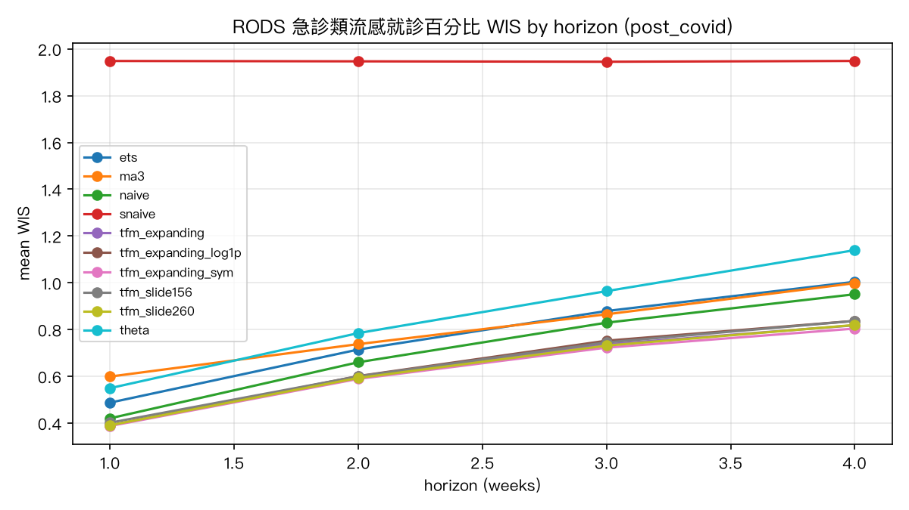
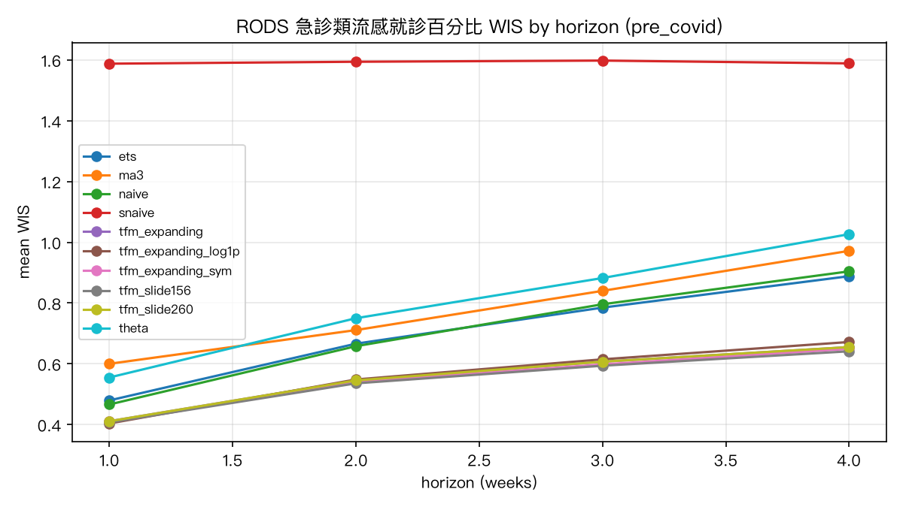
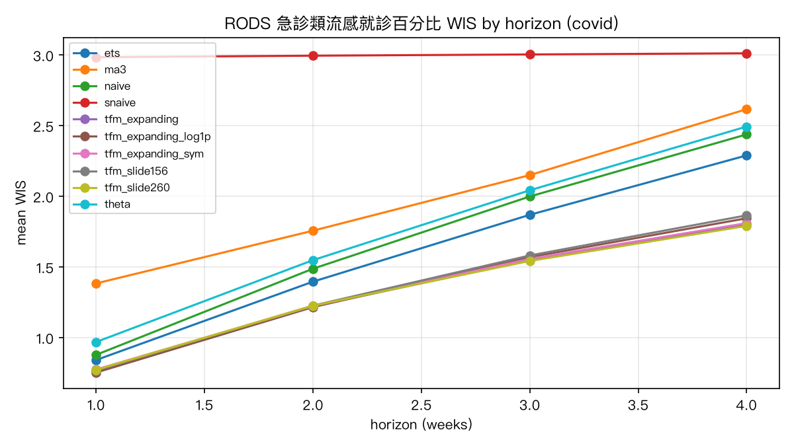
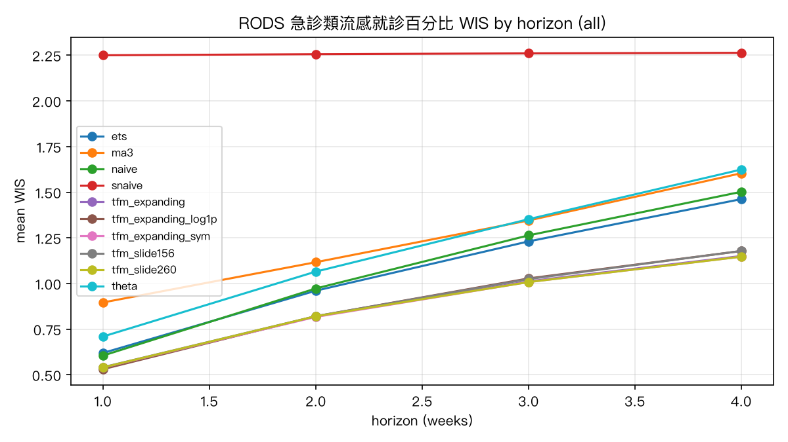
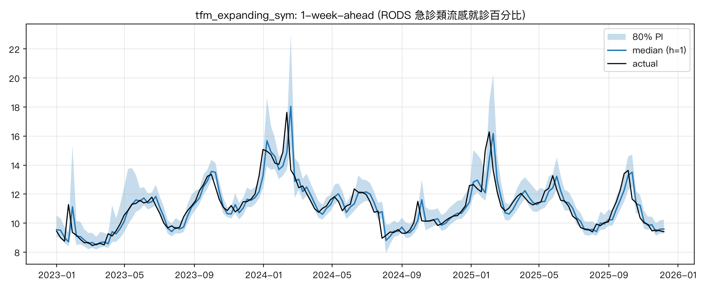
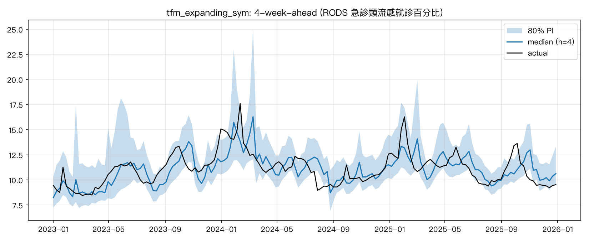
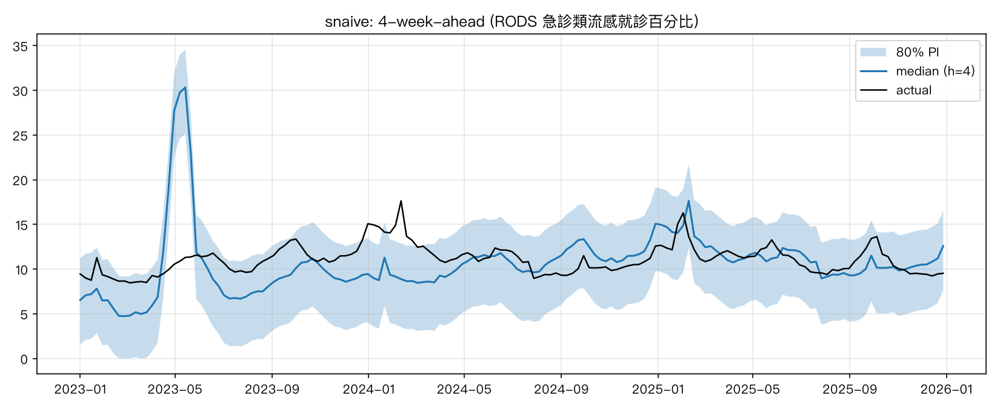

# 回測報告：RODS 急診類流感就診百分比

- 目標序列：`rods_ili_pct`；資料窗 2016w01–2025w53；起點 415 個（最後 context 週 201752–202549）；h = 1–4
- 分段：COVID 前 = 目標週落在 2018–2019、COVID 期 = 2020–2022、COVID 後 = 2023–2025
- WIS 越低越好；rel_wis = 相對季節性 naive 的 WIS（< 1 表示優於季節性 naive）；mape 為百分比；cov80 / cov60 = 80% / 60% 區間涵蓋率（理想 0.80 / 0.60）

## COVID 後（2023–2025，主要決策依據）：h = 1–4 平均

| config              |   wis |   mae |   mape |   mase |   cov80 |   cov60 |   rel_wis |
|:--------------------|------:|------:|-------:|-------:|--------:|--------:|----------:|
| tfm_expanding_sym   | 0.626 | 0.789 |  6.842 |  0.251 |   0.796 |   0.572 |     0.321 |
| tfm_slide260        | 0.634 | 0.799 |  6.93  |  0.254 |   0.77  |   0.534 |     0.325 |
| tfm_expanding       | 0.635 | 0.803 |  6.976 |  0.256 |   0.762 |   0.535 |     0.326 |
| tfm_expanding_log1p | 0.645 | 0.822 |  7.144 |  0.262 |   0.784 |   0.542 |     0.331 |
| tfm_slide156        | 0.646 | 0.817 |  7.096 |  0.26  |   0.78  |   0.571 |     0.332 |
| naive               | 0.715 | 0.884 |  7.695 |  0.282 |   0.855 |   0.589 |     0.367 |
| ets                 | 0.771 | 0.885 |  7.703 |  0.282 |   0.963 |   0.889 |     0.396 |
| ma3                 | 0.8   | 0.998 |  8.726 |  0.318 |   0.855 |   0.577 |     0.411 |
| theta               | 0.859 | 0.929 |  8.06  |  0.297 |   0.958 |   0.879 |     0.441 |
| snaive              | 1.947 | 2.416 | 21.697 |  0.763 |   0.916 |   0.706 |     1     |

### WIS 依 horizon（post_covid）

| config              |   1 |   2 |   3 |   4 |
|:--------------------|----:|----:|----:|----:|
| tfm_expanding_sym   |   0 |   1 |   1 |   1 |
| tfm_expanding       |   0 |   1 |   1 |   1 |
| tfm_expanding_log1p |   0 |   1 |   1 |   1 |
| tfm_slide260        |   0 |   1 |   1 |   1 |
| tfm_slide156        |   0 |   1 |   1 |   1 |
| naive               |   0 |   1 |   1 |   1 |
| ets                 |   0 |   1 |   1 |   1 |
| theta               |   1 |   1 |   1 |   1 |
| ma3                 |   1 |   1 |   1 |   1 |
| snaive              |   2 |   2 |   2 |   2 |

## COVID 前（2018–2019）：h = 1–4 平均

| config              |   wis |   mae |   mape |   mase |   cov80 |   cov60 |   rel_wis |
|:--------------------|------:|------:|-------:|-------:|--------:|--------:|----------:|
| tfm_slide156        | 0.545 | 0.673 |  5.773 |  0.226 |   0.834 |   0.63  |     0.342 |
| tfm_expanding_sym   | 0.549 | 0.675 |  5.793 |  0.227 |   0.856 |   0.652 |     0.345 |
| tfm_expanding       | 0.555 | 0.682 |  5.853 |  0.23  |   0.834 |   0.647 |     0.348 |
| tfm_slide260        | 0.555 | 0.682 |  5.853 |  0.23  |   0.834 |   0.647 |     0.348 |
| tfm_expanding_log1p | 0.56  | 0.69  |  5.944 |  0.232 |   0.854 |   0.654 |     0.352 |
| ets                 | 0.705 | 0.807 |  6.928 |  0.269 |   0.924 |   0.839 |     0.443 |
| naive               | 0.706 | 0.807 |  6.93  |  0.269 |   0.905 |   0.722 |     0.443 |
| ma3                 | 0.781 | 0.908 |  7.85  |  0.303 |   0.88  |   0.693 |     0.49  |
| theta               | 0.804 | 0.817 |  7.009 |  0.273 |   0.949 |   0.875 |     0.505 |
| snaive              | 1.592 | 1.978 | 18.057 |  0.66  |   0.917 |   0.737 |     1     |

### WIS 依 horizon（pre_covid）

| config              |   1 |   2 |   3 |   4 |
|:--------------------|----:|----:|----:|----:|
| tfm_expanding_log1p |   0 |   1 |   1 |   1 |
| tfm_slide156        |   0 |   1 |   1 |   1 |
| tfm_expanding_sym   |   0 |   1 |   1 |   1 |
| tfm_expanding       |   0 |   1 |   1 |   1 |
| tfm_slide260        |   0 |   1 |   1 |   1 |
| naive               |   0 |   1 |   1 |   1 |
| ets                 |   0 |   1 |   1 |   1 |
| theta               |   1 |   1 |   1 |   1 |
| ma3                 |   1 |   1 |   1 |   1 |
| snaive              |   2 |   2 |   2 |   2 |

## COVID 期（2020–2022）：h = 1–4 平均

| config              |   wis |   mae |   mape |   mase |   cov80 |   cov60 |   rel_wis |
|:--------------------|------:|------:|-------:|-------:|--------:|--------:|----------:|
| tfm_slide260        | 1.334 | 1.61  | 14.688 |  0.555 |   0.728 |   0.503 |     0.444 |
| tfm_expanding       | 1.335 | 1.599 | 14.575 |  0.552 |   0.728 |   0.497 |     0.445 |
| tfm_expanding_sym   | 1.343 | 1.61  | 14.59  |  0.556 |   0.715 |   0.482 |     0.447 |
| tfm_expanding_log1p | 1.347 | 1.618 | 14.935 |  0.559 |   0.739 |   0.494 |     0.448 |
| tfm_slide156        | 1.361 | 1.634 | 15.07  |  0.562 |   0.725 |   0.533 |     0.453 |
| ets                 | 1.6   | 1.876 | 17.646 |  0.646 |   0.774 |   0.682 |     0.533 |
| naive               | 1.702 | 1.874 | 17.628 |  0.645 |   0.752 |   0.543 |     0.567 |
| theta               | 1.764 | 1.892 | 17.848 |  0.652 |   0.833 |   0.769 |     0.588 |
| ma3                 | 1.978 | 2.179 | 20.993 |  0.747 |   0.752 |   0.533 |     0.659 |
| snaive              | 3     | 3.761 | 46.344 |  1.311 |   0.677 |   0.494 |     1     |

### WIS 依 horizon（covid）

| config              |   1 |   2 |   3 |   4 |
|:--------------------|----:|----:|----:|----:|
| tfm_expanding_log1p |   1 |   1 |   2 |   2 |
| tfm_expanding       |   1 |   1 |   2 |   2 |
| tfm_slide156        |   1 |   1 |   2 |   2 |
| tfm_slide260        |   1 |   1 |   2 |   2 |
| tfm_expanding_sym   |   1 |   1 |   2 |   2 |
| ets                 |   1 |   1 |   2 |   2 |
| naive               |   1 |   1 |   2 |   2 |
| theta               |   1 |   2 |   2 |   2 |
| ma3                 |   1 |   2 |   2 |   3 |
| snaive              |   3 |   3 |   3 |   3 |

## 全期（2018–2025）：h = 1–4 平均

| config              |   wis |   mae |   mape |   mase |   cov80 |   cov60 |   rel_wis |
|:--------------------|------:|------:|-------:|-------:|--------:|--------:|----------:|
| tfm_expanding_sym   | 0.878 | 1.072 |  9.516 |  0.361 |   0.78  |   0.558 |     0.389 |
| tfm_slide260        | 0.879 | 1.077 |  9.601 |  0.362 |   0.77  |   0.55  |     0.389 |
| tfm_expanding       | 0.88  | 1.075 |  9.575 |  0.362 |   0.767 |   0.548 |     0.39  |
| tfm_expanding_log1p | 0.89  | 1.091 |  9.797 |  0.367 |   0.784 |   0.551 |     0.394 |
| tfm_slide156        | 0.892 | 1.091 |  9.788 |  0.366 |   0.772 |   0.571 |     0.395 |
| ets                 | 1.069 | 1.24  | 11.275 |  0.417 |   0.882 |   0.798 |     0.473 |
| naive               | 1.086 | 1.24  | 11.266 |  0.416 |   0.828 |   0.604 |     0.481 |
| theta               | 1.188 | 1.266 | 11.505 |  0.425 |   0.908 |   0.837 |     0.526 |
| ma3                 | 1.241 | 1.423 | 13.151 |  0.477 |   0.822 |   0.589 |     0.549 |
| snaive              | 2.258 | 2.817 | 30.123 |  0.945 |   0.826 |   0.633 |     1     |

### WIS 依 horizon（all）

| config              |   1 |   2 |   3 |   4 |
|:--------------------|----:|----:|----:|----:|
| tfm_expanding_log1p |   1 |   1 |   1 |   1 |
| tfm_expanding       |   1 |   1 |   1 |   1 |
| tfm_expanding_sym   |   1 |   1 |   1 |   1 |
| tfm_slide260        |   1 |   1 |   1 |   1 |
| tfm_slide156        |   1 |   1 |   1 |   1 |
| naive               |   1 |   1 |   1 |   2 |
| ets                 |   1 |   1 |   1 |   1 |
| theta               |   1 |   1 |   1 |   2 |
| ma3                 |   1 |   1 |   1 |   2 |
| snaive              |   2 |   2 |   2 |   2 |

## 各年 WIS（h = 1 與 h = 4）

### h = 1

| config              |   2018 |   2019 |   2020 |   2021 |   2022 |   2023 |   2024 |   2025 |
|:--------------------|-------:|-------:|-------:|-------:|-------:|-------:|-------:|-------:|
| ets                 |      0 |      0 |      1 |      1 |      1 |      0 |      1 |      1 |
| ma3                 |      1 |      1 |      1 |      1 |      2 |      0 |      1 |      1 |
| naive               |      0 |      0 |      1 |      1 |      1 |      0 |      0 |      0 |
| snaive              |      2 |      1 |      3 |      3 |      3 |      3 |      2 |      1 |
| tfm_expanding       |      0 |      0 |      1 |      1 |      1 |      0 |      0 |      0 |
| tfm_expanding_log1p |      0 |      0 |      1 |      1 |      1 |      0 |      0 |      0 |
| tfm_expanding_sym   |      0 |      0 |      1 |      1 |      1 |      0 |      0 |      0 |
| tfm_slide156        |      0 |      0 |      1 |      1 |      1 |      0 |      0 |      0 |
| tfm_slide260        |      0 |      0 |      1 |      1 |      1 |      0 |      0 |      0 |
| theta               |      1 |      1 |      1 |      1 |      1 |      1 |      1 |      1 |

### h = 4

| config              |   2018 |   2019 |   2020 |   2021 |   2022 |   2023 |   2024 |   2025 |
|:--------------------|-------:|-------:|-------:|-------:|-------:|-------:|-------:|-------:|
| ets                 |      1 |      1 |      1 |      2 |      4 |      1 |      1 |      1 |
| ma3                 |      1 |      1 |      2 |      2 |      4 |      1 |      1 |      1 |
| naive               |      1 |      1 |      2 |      2 |      4 |      1 |      1 |      1 |
| snaive              |      2 |      1 |      3 |      3 |      3 |      3 |      2 |      1 |
| tfm_expanding       |      1 |      1 |      1 |      2 |      3 |      1 |      1 |      1 |
| tfm_expanding_log1p |      1 |      1 |      1 |      2 |      3 |      1 |      1 |      1 |
| tfm_expanding_sym   |      1 |      1 |      1 |      2 |      3 |      1 |      1 |      1 |
| tfm_slide156        |      1 |      1 |      1 |      2 |      3 |      1 |      1 |      1 |
| tfm_slide260        |      1 |      1 |      1 |      2 |      3 |      1 |      1 |      1 |
| theta               |      1 |      1 |      2 |      2 |      4 |      1 |      1 |      1 |

## 命中率（hit rate）

定義：`dir_hit` = 方向命中率（中位數相對起點週的漲/跌方向與實際一致）；`dir_hit3` = 三分類（漲 / 持平 / 跌，±5% 為持平帶）命中率；`hit_tol10` = 中位數落在實際值 ±10% 內的比例；`hit80` = 實際值落在 q10–q90 內的比例（= 80% 涵蓋率）；`thr_hit_rate` = 閾值命中率（敏感度：實際 ≥ 閾值的週中，中位數也 ≥ 閾值的比例），`thr_false_alarm` = 誤報率，`thr_accuracy` = 整體準確率；閾值 = 10.0（流行閾值 10%（使用者指定））。
last-value naive 的中位數等於起點值，方向命中率因此退化（永遠不預測上漲、三分類永遠預測持平），僅供對照。

### COVID 後（2023–2025，主要決策依據）：h = 1–4 平均

| config              |   dir_hit |   dir_hit3 |   hit_tol10 |   hit80 |   thr_hit_rate |   thr_false_alarm |   thr_accuracy |
|:--------------------|----------:|-----------:|------------:|--------:|---------------:|------------------:|---------------:|
| tfm_expanding_sym   |     0.683 |      0.498 |       0.758 |   0.796 |          0.92  |             0.256 |          0.872 |
| tfm_slide260        |     0.656 |      0.495 |       0.765 |   0.77  |          0.92  |             0.233 |          0.878 |
| tfm_expanding       |     0.662 |      0.483 |       0.757 |   0.762 |          0.916 |             0.256 |          0.869 |
| tfm_expanding_log1p |     0.637 |      0.49  |       0.753 |   0.784 |          0.909 |             0.256 |          0.864 |
| tfm_slide156        |     0.633 |      0.466 |       0.747 |   0.78  |          0.912 |             0.256 |          0.865 |
| naive               |     0.484 |      0.448 |       0.731 |   0.855 |          0.887 |             0.297 |          0.836 |
| ets                 |     0.487 |      0.448 |       0.732 |   0.963 |          0.887 |             0.297 |          0.836 |
| ma3                 |     0.378 |      0.44  |       0.658 |   0.855 |          0.867 |             0.345 |          0.809 |
| theta               |     0.477 |      0.462 |       0.712 |   0.958 |          0.887 |             0.274 |          0.843 |
| snaive              |     0.603 |      0.369 |       0.309 |   0.916 |          0.619 |             0.411 |          0.611 |

方向命中率依 horizon（post_covid）：

| config              |     1 |     2 |     3 |     4 |
|:--------------------|------:|------:|------:|------:|
| tfm_expanding_sym   | 0.662 | 0.677 | 0.699 | 0.694 |
| tfm_slide260        | 0.643 | 0.639 | 0.667 | 0.675 |
| tfm_expanding       | 0.643 | 0.652 | 0.679 | 0.675 |
| tfm_expanding_log1p | 0.617 | 0.626 | 0.654 | 0.65  |
| tfm_slide156        | 0.604 | 0.639 | 0.635 | 0.656 |
| naive               | 0.474 | 0.51  | 0.481 | 0.471 |
| ets                 | 0.526 | 0.503 | 0.462 | 0.459 |
| ma3                 | 0.331 | 0.4   | 0.385 | 0.395 |
| theta               | 0.422 | 0.535 | 0.474 | 0.478 |
| snaive              | 0.558 | 0.6   | 0.603 | 0.65  |

### 全期（2018–2025）：h = 1–4 平均

| config              |   dir_hit |   dir_hit3 |   hit_tol10 |   hit80 |   thr_hit_rate |   thr_false_alarm |   thr_accuracy |
|:--------------------|----------:|-----------:|------------:|--------:|---------------:|------------------:|---------------:|
| tfm_expanding_sym   |     0.664 |      0.515 |       0.708 |   0.78  |          0.883 |             0.108 |          0.887 |
| tfm_slide260        |     0.65  |      0.515 |       0.715 |   0.77  |          0.882 |             0.103 |          0.889 |
| tfm_expanding       |     0.656 |      0.511 |       0.716 |   0.767 |          0.878 |             0.108 |          0.885 |
| tfm_expanding_log1p |     0.643 |      0.508 |       0.707 |   0.784 |          0.877 |             0.108 |          0.884 |
| tfm_slide156        |     0.633 |      0.496 |       0.701 |   0.772 |          0.883 |             0.108 |          0.887 |
| ets                 |     0.469 |      0.429 |       0.686 |   0.882 |          0.876 |             0.141 |          0.867 |
| naive               |     0.472 |      0.429 |       0.686 |   0.828 |          0.876 |             0.141 |          0.867 |
| theta               |     0.429 |      0.434 |       0.677 |   0.908 |          0.873 |             0.141 |          0.866 |
| ma3                 |     0.402 |      0.423 |       0.616 |   0.822 |          0.846 |             0.173 |          0.837 |
| snaive              |     0.603 |      0.378 |       0.234 |   0.826 |          0.556 |             0.415 |          0.57  |

方向命中率依 horizon（all）：

| config              |     1 |     2 |     3 |     4 |
|:--------------------|------:|------:|------:|------:|
| tfm_expanding_sym   | 0.643 | 0.648 | 0.672 | 0.694 |
| tfm_slide260        | 0.629 | 0.634 | 0.66  | 0.677 |
| tfm_expanding       | 0.627 | 0.641 | 0.67  | 0.687 |
| tfm_expanding_log1p | 0.624 | 0.643 | 0.646 | 0.658 |
| tfm_slide156        | 0.59  | 0.641 | 0.646 | 0.653 |
| ets                 | 0.484 | 0.48  | 0.472 | 0.439 |
| naive               | 0.472 | 0.494 | 0.463 | 0.46  |
| theta               | 0.405 | 0.463 | 0.427 | 0.422 |
| ma3                 | 0.383 | 0.407 | 0.405 | 0.412 |
| snaive              | 0.552 | 0.581 | 0.622 | 0.658 |

## 診斷：偏差與 MAPE（最佳設定 vs 基準）

### 平均帶號偏差 %（中位數 − 實際）/ 實際；正值 = 高估

|                                     |    1 |    2 |    3 |    4 |
|:------------------------------------|-----:|-----:|-----:|-----:|
| ('ma3', 'covid')                    |  3.3 |  4.8 |  6.9 |  9.8 |
| ('ma3', 'post_covid')               |  0.4 |  0.5 |  0.7 |  0.8 |
| ('ma3', 'pre_covid')                |  0.5 |  0.8 |  1.2 |  1.8 |
| ('naive', 'covid')                  |  1.2 |  3.2 |  5.5 |  8.1 |
| ('naive', 'post_covid')             |  0.2 |  0.4 |  0.6 |  0.7 |
| ('naive', 'pre_covid')              |  0.3 |  0.7 |  1   |  1.5 |
| ('snaive', 'covid')                 | 21.5 | 21.5 | 21.5 | 21.5 |
| ('snaive', 'post_covid')            | -4.1 | -4   | -3.8 | -3.6 |
| ('snaive', 'pre_covid')             |  0.3 |  0.6 |  0.8 |  1.1 |
| ('tfm_expanding_sym', 'covid')      | -0.8 | -0.2 |  0.6 |  1.3 |
| ('tfm_expanding_sym', 'post_covid') |  0.1 |  0.3 |  0.4 |  0.3 |
| ('tfm_expanding_sym', 'pre_covid')  | -0   |  0.1 |  0.1 |  0.3 |

### MAPE %

|                                     |    1 |    2 |    3 |    4 |
|:------------------------------------|-----:|-----:|-----:|-----:|
| ('ma3', 'covid')                    | 14.1 | 18.1 | 22.9 | 28.8 |
| ('ma3', 'post_covid')               |  6.4 |  8   |  9.5 | 11.1 |
| ('ma3', 'pre_covid')                |  6   |  7.1 |  8.4 |  9.9 |
| ('naive', 'covid')                  |  8.8 | 15   | 20.7 | 26.1 |
| ('naive', 'post_covid')             |  4.3 |  7   |  9   | 10.5 |
| ('naive', 'pre_covid')              |  4.4 |  6.4 |  7.9 |  9.1 |
| ('snaive', 'covid')                 | 46.3 | 46.3 | 46.3 | 46.3 |
| ('snaive', 'post_covid')            | 21.7 | 21.7 | 21.7 | 21.7 |
| ('snaive', 'pre_covid')             | 18.1 | 18.1 | 18.1 | 18   |
| ('tfm_expanding_sym', 'covid')      |  8.4 | 13   | 17   | 20   |
| ('tfm_expanding_sym', 'post_covid') |  4   |  6.4 |  7.9 |  9   |
| ('tfm_expanding_sym', 'pre_covid')  |  4.1 |  5.5 |  6.3 |  7.2 |

### COVID 後高流行週（實際值 ≥ 第 75 百分位 12；39 週）

WIS：

| config              |   1 |   2 |   3 |   4 |
|:--------------------|----:|----:|----:|----:|
| ets                 |   1 |   1 |   1 |   1 |
| ma3                 |   1 |   1 |   1 |   1 |
| naive               |   1 |   1 |   1 |   1 |
| snaive              |   2 |   2 |   2 |   2 |
| tfm_expanding       |   1 |   1 |   1 |   1 |
| tfm_expanding_log1p |   1 |   1 |   1 |   1 |
| tfm_expanding_sym   |   1 |   1 |   1 |   1 |
| tfm_slide156        |   1 |   1 |   1 |   1 |
| tfm_slide260        |   1 |   1 |   1 |   1 |
| theta               |   1 |   1 |   1 |   1 |

偏差 %：

| config              |     1 |     2 |     3 |     4 |
|:--------------------|------:|------:|------:|------:|
| ets                 |  -0.9 |  -3   |  -5.7 |  -8.2 |
| ma3                 |  -3.2 |  -4.8 |  -7   |  -9.2 |
| naive               |  -1   |  -3   |  -5.7 |  -8.2 |
| snaive              | -16.3 | -16.3 | -16.3 | -16.3 |
| tfm_expanding       |  -0.9 |  -2.3 |  -4.6 |  -6.6 |
| tfm_expanding_log1p |  -0.7 |  -2   |  -4.5 |  -6.8 |
| tfm_expanding_sym   |  -1   |  -2.9 |  -5.5 |  -7.6 |
| tfm_slide156        |  -0.7 |  -2.4 |  -5.1 |  -7.6 |
| tfm_slide260        |  -0.8 |  -2.5 |  -5   |  -6.9 |
| theta               |  -1.5 |  -3.2 |  -5.4 |  -6.7 |

## 最佳設定 `tfm_expanding_sym` 的 1 週前預測 vs 實際（2023 起）

## 最佳設定 `tfm_expanding_sym` 的 4 週前預測 vs 實際（2023 起）

## 對照：季節性 naive 的 4 週前預測

